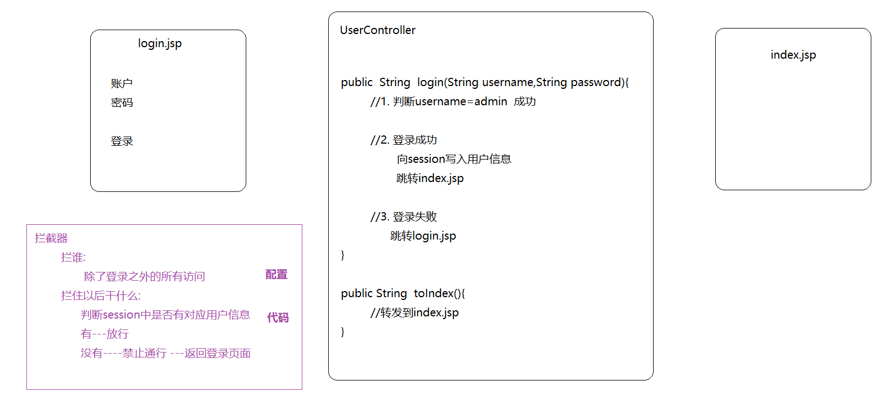

## 今日内容

+ 页面跳转
  + 转发
    + 传参
  + 重定向
+ 释放静态资源
+ Ajax+json实现异步交互
+ restful风格
+ 异常处理机制
+ 拦截器

## 第一章 页面跳转之转发

### 1. 方式一:简单方式

#### 1.1 页面

```jsp
<a href="${pageContext.request.contextPath}/demoController/demo1">
    转发--简单方式
</a><br>
```

#### 1.2后台

```java
@RequestMapping("/demoController/demo1")
public String demo1() {

    System.out.println("到达了后台demo1");
    // 方式一: 简单类型转发,这种方式是会拼接前后缀的
    return "success";
}
```

 

### 2. 方式二:使用forward转发

#### 2.1 页面

```jsp
<a href="${pageContext.request.contextPath}/demoController/demo2">
    转发--forward方式
</a><br>
```

 

#### 2.2 后台

```java
@RequestMapping("/demoController/demo2")
public String demo2() {

    System.out.println("到达了后台demo2");
    // 方式二: forward关键字,这种方式不会拼接前后缀
    return "forward:/fail.jsp";
}
```

 

### 3. 方式三:使用servlet原生API(了解)

#### 3.1页面

```jsp
<a href="${pageContext.request.contextPath}/demoController/demo3">
    转发--原生api方式
</a><br>
```

####  3.2后台

```java
@RequestMapping("/demoController/demo3")
public void demo3(HttpServletRequest request, HttpServletResponse response) throws ServletException, IOException {
    
    System.out.println("到达了后台demo3");
    // 方式三: 原生api方式,这种方式不会拼接前后缀
    request.getRequestDispatcher("/WEB-INF/success.jsp").forward(request,response);
}
```

 

### 4. 转发过程中的数据传递

#### 4.1 方式一

 

```java
/**
 * 转发,传递参数
 * @return
 */
@RequestMapping("/demoController/demo111")
public String demo111(HttpServletRequest request) {

    System.out.println("到达了后台demo1");
    // 方式一: 使用request域进行参数传递
    request.setAttribute("name","公孙嘏");
    return "success";
}
```

```jsp
<%@ page contentType="text/html;charset=UTF-8" language="java" %>
<html>
    <head>
        <title>Title</title>
    </head>
    <body>

        SUCCESS!!!!<br>
        传递来的参数:${name}

    </body>
</html>
```

#### 4.2 方式二(了解)

```java
@RequestMapping("/demoController/demo111")
public String demo111(Model model, ModelMap map) {

    System.out.println("到达了后台demo1");
    // 方式二: 使用Model进行传值,底层将数据放入request域进行数据的传递

    // 1. model方式
    // model.addAttribute("name","东方代分");
    // 2. map方式
    map.put("name","东方代分");
    return "success";
}
```

#### 4.3 方式三(了解)

```java
@RequestMapping("/demoController/demo111")
public ModelAndView demo111(ModelAndView mv) {

    System.out.println("到达了后台demo1");
    // 添加数据
    mv.addObject("name","龚戴朗");
    // 设置视图
    mv.setViewName("success");

    return mv;
}
```

##  第二章 页面跳转之重定向

### 1. 方式一:使用redirect重定向

#### 1.1页面

```jsp
<a href="${pageContext.request.contextPath}/demoController/demo4">
    重定向--redirect
</a><br>
```

####  1.2后台

```java
/**
 *  重定向
 */
@RequestMapping("/demoController/demo4")
public String demo4(){
    System.out.println("到达了后台demo4");
    // 方式一:redirect方式重定向操作
    return "redirect:/fail.jsp";
}
```

 

### 2. 方式二:使用servlet原生API(了解)

#### 2.1页面

```jsp
<a href="${pageContext.request.contextPath}/demoController/demo5">
    重定向--原生api方式
</a><br>
```

#### 2.2后台

```java
/**
 * 方式二
 */
@RequestMapping("/demoController/demo5")
public void demo5(HttpServletRequest request,HttpServletResponse response) throws IOException {
    System.out.println("到达了后台demo5");
    // 方式二:使用原生的api
    response.sendRedirect(request.getContextPath()+"/fail.jsp");
}
```

 

### 3. 补充:通过重定向访问WEB-INF下资源(经过了一次转发)

#### 3.1 页面

```jsp
<a href="${pageContext.request.contextPath}/demoController/demo6">
    通过重定向访问WEB-INF下资源(经过了一次转发)
</a><br>
```

####  3.2 后台

```java
/**
 * 通过重定向访问WEB-INF下资源(经过了一次转发)
 */
@RequestMapping("/demoController/demo6")
public String demo6() {
    System.out.println("到达了后台demo6");
    return "redirect:/demoController/demo1";
}
```

 


## 第三章 释放静态资源(会用)

> 当有静态资源需要加载时，比如jquery.js，会出现404现象。[ noHandlerFound No mapping for GET /js/jquery-3.3.1.js ]
>
> 之所以发生这种情况是因为：现在SpringMVC的前端控制器DispatcherServlet的url-pattern配置的是 /，代表除了jsp请求不拦截，
>
> 其他的所有请求都会拦截，包括一些静态文件(js  html  css  jpg等等)，而拦截住之后，它又找不到对应的处理器方法来处理，因此报错。

> 配置文件 spring-mvc.xml

### 1. 方式一(了解)

```xml
<!--
释放静态资源方式一(了解):
mapping 用来指定一个映射规则，匹配访问地址
location如果一个访问的地址可以被mapping指定的规则匹配上，就不再去调用处理器映射器查找相应的方法了，而是直接去location指定路径下获取资源
-->
<mvc:resources mapping="/js/*" location="/js/" />
```

###  2. 方式二(推荐)

```xml
<!--
    释放静态资源方式二
    配置下面的选项之前, 请求是这样访问的: 前端控制器会将请求传给处理器映射器去寻找对应的处理方法,如果找不到,就会报404错误
    配置下面的选项之后, 请求是这样访问的: 前端控制器会将请求传给处理器映射器去寻找对应的处理方法,如果找不到,暂时不要不错
                                        而是将这个请求转交给外部容器(Tomcat)的默认处理器(default-servlet)去处理
-->
<mvc:default-servlet-handler />
```

### 3. 方式三(掌握)

```xml
<!--
静态释放资源三之拦截设置
这种写法代表拦截的是所有以.do结尾的访问地址,这就要求所有请求路径上都要加.do
-->
<url-pattern>*.do</url-pattern>
```

> 注意： springmvc查找的时候是这样的:
>
> > 1. 先找最标准的
> > 2. 如果找不到,去掉后缀再次寻找
> > 3. 方法处可以不写.do


## 第四章 Ajax+json实现异步交互(专题)


接下来我们研究ajax异步发送请求数据，后端返回json响应

在SpringMVC中,  这个功能主要是通过两个注解@RequestBody和@ResponseBody实现的

注意:  Springmvc默认用MappingJackson2HttpMessageConverter对json数据进行转换，需要加入jackson的包

**注意: 这个jackson的包,SpringMVC底层没有引入,需要我们单独导入**

```xml
<!--引入jackson-->
<dependency>
    <groupId>com.fasterxml.jackson.core</groupId>
    <artifactId>jackson-databind</artifactId>
    <version>2.9.8</version>
</dependency>
```

 

> @RequestBody用于接收前端传递的请求体中的json数据，并可以自动转换封装进指定的对象中。
>
> @ResponseBody用于将controller方法返回的对象通过转换器转换为指定的格式( 通常为json )之后，再写回响应。

### 1. 页面

```js
<%--Ajax+json实现异步交互--%>
<%--引入jq--%>
<script src="${pageContext.request.contextPath}/js/jquery-3.3.1.js"/>
        <button id="ajax-json">Ajax+json实现异步交互</button>
        <script>
            $("#ajax-json").click(function () {
                $.ajax({
                    type:"POST",
                    url:"${pageContext.request.contextPath}/demoController/demo7",
                    contentType:"application/json",/*代表是前台发送到后台的数据类型是json必须写*/
                    dataType:"json",/*要求后台返回的数据类型*/
                    data:'[{"name":"丁凤","age":18},{"name":"北山勃","age":19}]',
                    success:function (data) {

                    }
                });
            });
</script>
```

 

### 2. 封装一个User类

```java
public class User {
    private String name;
    private Integer age;

    public String getName() {
        return name;
    }

    public void setName(String name) {
        this.name = name;
    }

    public Integer getAge() {
        return age;
    }

    public void setAge(Integer age) {
        this.age = age;
    }

    @Override
    public String toString() {
        return "User{" +
                "name='" + name + '\'' +
                ", age=" + age +
                '}';
    }
}
```

 

### 3.后台

```java
/**
 * @ResponseBody 用于将controller方法返回的对象通过转换器转换为指定的格式( 通常为json )之后，再写回响应。
 *     
 * @RequestBody 在请求体中获取json类型的数据,然后封装到指定集合或对象中
 */
@ResponseBody
@RequestMapping("/demoController/demo7")
public List<User> demo7(@RequestBody List<User> users) {
    System.out.println("到达了后台demo7");
    System.out.println(users);
    return users;
}
```

 

### 4. 显示返回信息

```js
<script>
    $("#ajax-json").click(function () {
        $.ajax({
            type:"POST",
            url:"${pageContext.request.contextPath}/demoController/demo7",
            contentType:"application/json",/*代表是前台发送到后台的数据类型是json必须写*/
            dataType:"json",/*要求后台返回的数据类型*/
            data:'[{"name":"丁凤","age":18},{"name":"北山勃","age":19}]',
            success:function (data) {
                for (let e of data){
                    alert(e.name);
                }
            }
        });
    });
</script>
```

 


## 第五章 restful风格(了解 )

### 1. 什么是restful风格

> REST是一种软件架构风格，其强调HTTP应当以资源为中心[**在请求地址中尽量的不要出现动词**]。
>
> REST规范了HTTP请求动作，使用四个词语分别表示对资源的CRUD操作: 
>
> ​		GET(获取)、POST(新建)、PUT(更新)、DELETE(删除) 
>

|          | 原来             | Restful            |
| -------- | ---------------- | ------------------ |
| 保存     | /saveUser        | POST     /user     |
| 修改     | /updateUser      | PUT       /user    |
| 删除     | /deleteUser?id=1 | DELETE  /user/1    |
| 查询所有 | /findAllUsers    | GET        /user   |
| 查询一个 | /findById?id=1   | GET        /user/1 |

### 2. 保存

#### 2.1 页面

```jsp
<%--restful风格--%>
<button id="restful">restful风格测试</button><br>
<script>
    $("#restful").click(function () {
        $.ajax({
            type: "POST",
            url: "${pageContext.request.contextPath}/user",
            contentType: "application/json",/*代表是前台发送到后台的数据类型是json必须写*/
            dataType: "json",/*要求后台返回的数据类型*/
            data: '{"name":"丁凤","age":18}',
            success: function (data) {
                alert("提交成功...");
            }
        });
    });
</script>
```

 

#### 2.2后台

```java
/**
 * 保存用户
 */
@ResponseBody
@RequestMapping(value = "/user",method = RequestMethod.GET)
public void findAll(){
    System.out.println("findAll");
}
/**
 * 查询
 */
@ResponseBody
@RequestMapping(value = "/user",method = RequestMethod.POST)
public void saveUser(User user){
    System.out.println("saveUser");
}
```

 

### 3.查询

#### 3.1 页面

```js
<%--restful风格--%>
<button id="restful-get">restful风格测试</button><br>
<script>
    $("#restful-get").click(function () {
        $.ajax({
            type: "GET",
            url: "${pageContext.request.contextPath}/user/id/1/name/zs",
            contentType: "application/json",/*代表是前台发送到后台的数据类型是json必须写*/
            dataType: "text",/*要求后台返回的数据类型*/
            data: '',
            success: function (data) {
                alert("提交成功...");
            }
        });
    });
</script>
```

 

#### 3.2 后台

```java
/**
 * 查询一个
 */
@ResponseBody
@RequestMapping(value = "/user/id/{id}/name/{name}",method = RequestMethod.GET)
public String findById(
        @PathVariable("id") Integer id,
        @PathVariable("name") String name
){
    System.out.println(id + name);

    System.out.println("saveUser");
    return name;
}
```

 


## 第六章 异常处理机制(掌握)

对于异常的处理一般有两种方式:

- 当前方法处理(try-catch)，这种处理方式会造成业务代码和异常处理代码的耦合

- 当前方法不处理, 出现异常后直接抛给调用者处理

使用Spring框架后，我们的代码最终是由框架来调用的。也就是说，异常最终会抛到框架中，然后由框架指定异常处理器来统一处理异常。 

### 1. 方式一：自定义异常处理器

> 重点:  自定义一个类实现HandlerExceptionResolver接口
>

#### 1.1 定义异常处理器的类

```java
/**
 * 添加注解,需加入包的扫描
 */
@Component
public class HandlerException implements HandlerExceptionResolver {
    public ModelAndView resolveException(HttpServletRequest httpServletRequest, HttpServletResponse httpServletResponse, Object o, Exception e) {
        // 记录日志
        System.out.println(new Date().toLocaleString()+e.getMessage());
        //返回页面
        ModelAndView mv = new ModelAndView();
        // 存在前后缀的拼接
        mv.setViewName("error");
        mv.addObject("message",e.getMessage());

        return mv;
    }
}
```

#### 1.2添加一个包扫描

```xml
<context:component-scan base-package="cn.com.mryhl.handlers"/>
```

###  2. 方式二：@ControllerAdvice注解

```java
/**
 * 此注解标注一个类上,代表是一个全局异常处理器的类
 */
@ControllerAdvice
public class HandlerException2{
    /**
     * 标在方法上,支持一个value属性,定义当前方法可以处理异常类型
     */
    @ExceptionHandler(Exception.class)
    public String resolveException2(Exception e,HttpServletRequest httpServletRequest) {
        // 记录日志
        System.out.println(new Date().toLocaleString()+e.getMessage());
        // 返回页面
        httpServletRequest.setAttribute("message", e.getMessage());
        return "error";
    }
}
```
## 第七章 拦截器(重点)

### 1. 什么是拦截器

> 拦截器是Spring提供的一种技术，它的功能似于过滤器Filter，它会在**进入controller之前，离开controller之后以及页面渲染完毕之后**进行拦截。

 

### 2. 自定义拦截器

> 重点: 自定义一个类实现HandlerInterceptor接口

#### 2.1 开发拦截器

```java
/**
 * 自定义拦截器
 * 实现HandlerInterceptor接口，重写方法
 */
public class MyHandlerInterceptor1 implements HandlerInterceptor {
    /**
     *  在controller之前执行
     */
    public boolean preHandle(HttpServletRequest request, HttpServletResponse response, Object handler) throws Exception {
        System.out.println("在controller之前执行=========1");
        // 此返回值代表的是 是否放行当前请求 默认值是false(禁止通行) true(放行)
        return true;
    }

    /**
     * 在离开controller之后执行
     */
    public void postHandle(HttpServletRequest request, HttpServletResponse response, Object handler, ModelAndView modelAndView) throws Exception {
        System.out.println("在离开controller之后执行=========1");
    }

    /**
     * 页面渲染完毕后执行
     */
    public void afterCompletion(HttpServletRequest request, HttpServletResponse response, Object handler, Exception ex) throws Exception {
        System.out.println("在页面渲染完之后执行=========1");
    }
}
```

#### 2.2配置拦截器

> spring-mvc.xml

```xml
<!--配置拦截器链-->
<mvc:interceptors>
    <!--配置拦截器-->
    <mvc:interceptor>
        <!--用于配置拦截规则-->
        <mvc:mapping path="/**"/>
        <!--用于配置不拦截的路径-->
        <mvc:exclude-mapping path="/demoController/demo1"/>
        <!--将上面的规则匹配中的访问请求,交给指定是拦截器处理-->
        <bean class="cn.com.mryhl.handlers.MyHandlerInterceptor1"></bean>
    </mvc:interceptor>
</mvc:interceptors>
```

#### 2.3 测试

```jsp
<a href="${pageContext.request.contextPath}/demoController/demo9">
    拦截模拟
</a><br>
```

> controller

```java
/**
 * 拦截器模拟
 */
@RequestMapping("/demoController/demo9")
public String demo9() {

    System.out.println("到达了后台demo9,进入了controller.....");
    return "success";
    // 运行效果
    /*
    在controller之前执行=========1
    到达了后台demo9,进入了controller.....
    在离开controller之后执行=========1
    在页面渲染完之后执行=========1
     */
}
```


### 3. 自定义拦截器链

> 开发中拦截器可以单独使用，也可以同时使用多个拦截器形成一条拦截器链。
>
> 开发步骤和单个拦截器是一样的，只不过注册的时候注册多个，**注意这里注册的顺序就代表拦截器执行的顺序**。

#### 3.1 再开发拦截器

```java
/**
 * 自定义拦截器
 * 实现HandlerInterceptor接口，重写方法
 */
public class MyHandlerInterceptor2 implements HandlerInterceptor {
    /**
     *  在controller之前执行
     */
    public boolean preHandle(HttpServletRequest request, HttpServletResponse response, Object handler) throws Exception {
        System.out.println("在controller之前执行=========2☺");
        // 此返回值代表的是 是否放行当前请求 默认值是false(禁止通行) true(放行)
        return true;
    }

    /**
     * 在离开controller之后执行
     */
    public void postHandle(HttpServletRequest request, HttpServletResponse response, Object handler, ModelAndView modelAndView) throws Exception {
        System.out.println("在离开controller之后执行=========2☺");
    }

    /**
     * 页面渲染完毕后执行
     */
    public void afterCompletion(HttpServletRequest request, HttpServletResponse response, Object handler, Exception ex) throws Exception {
        System.out.println("在页面渲染完之后执行=========2☺");
    }
}
```

 

#### 3.2 再配置拦截器

```xml
<!--配置拦截器链-->
<mvc:interceptors>
    <!--配置拦截器-->
    <mvc:interceptor>
        <!--用于配置拦截规则-->
        <mvc:mapping path="/**"/>
        <!--用于配置不拦截的路径-->
        <mvc:exclude-mapping path="/demoController/demo1"/>
        <!--将上面的规则匹配中的访问请求,交给指定是拦截器处理-->
        <bean class="cn.com.mryhl.handlers.MyHandlerInterceptor1"></bean>
    </mvc:interceptor>
    <mvc:interceptor>
        <mvc:mapping path="/**"/>
        <mvc:exclude-mapping path="/demoController/demo1"/>
        <bean class="cn.com.mryhl.handlers.MyHandlerInterceptor2"></bean>
    </mvc:interceptor>
</mvc:interceptors>
```

> 执行结果
>
> ```markdown
> 在controller之前执行=========1
> 在controller之前执行=========2?
> 到达了后台demo9,进入了controller.....
> 在离开controller之后执行=========2?
> 在离开controller之后执行=========1
> 在页面渲染完之后执行=========2?
> 在页面渲染完之后执行=========1
> ```
>
> 分析:
>
> 执行顺序与xml中配置的顺序有关.

### 4 . 补充:拦截器释放静态资源

```xml
<mvc:interceptors>
    <mvc:interceptor>
        <mvc:mapping path="/**"/>
        <mvc:exclude-mapping path="/**/*.css"/>
        <mvc:exclude-mapping path="/**/*.js"/>
        <mvc:exclude-mapping path="/**/*.png"/>
        <mvc:exclude-mapping path="/**/*.gif"/>
        <mvc:exclude-mapping path="/**/*.jpg"/>
        <mvc:exclude-mapping path="/**/*.jpeg"/>
    </mvc:interceptor>
</mvc:interceptors>
```

### 5 案例: 使用拦截器完成用户的访问拦截(重要)

> 用户访问一个主页面index.jsp(首页, 权限控制)
>
> ​	如果用户已经登录，即可成功访问
>
> ​	如果用户没有登录，不允许访问，返回登录页面login.jsp

#### 5.1 思路分析

 

#### 5.2 复制工程

```xml
<module>day05_mvc_login</module>
```

#### 5.3 login.jsp

```jsp
<%@ page contentType="text/html;charset=UTF-8" language="java" %>
<%--
  User: mr_yhl
  Date: 2020/9/27
  Time: 20:29  
--%>
<html>
    <head>
        <title>Login登陆</title>
    </head>
    <body>
        <form action="${pageContext.request.contextPath}/userController/login" method="post">
            用户姓名:<input type="text" name="username"><br>
            安全密码:<input type="text" name="password"><br>
            <input type="submit" value="提交">
        </form>

    </body>
</html>
```

 

#### 5.4 配置欢迎页

```xml
<!--配置欢迎页面-->
<welcome-file-list>
    <welcome-file>login.jsp</welcome-file>
</welcome-file-list>
```

####  5.5 UserController

```java
@Controller
public class UserController {
    /**
     * 登录
     * @return
     */
    @RequestMapping("/userController/login")
    public String login(String username, String password, HttpSession session) {
        if ("admin".equals(username)){
            // 记录session
            session.setAttribute("loginname",username);

            // 跳转到主页面
            return "redirect:/userController/toIndex";
        }else {
            //登录失败
            return "redirect:/login.jsp";
        }

    }


    /**
     * 跳转到主页
     * @return
     */
    @RequestMapping("/userController/toIndex")
    public String toIndex(){
        return "index";
    }
}
```

#### 5.6 index.jsp

```jsp
<%@ page contentType="text/html;charset=UTF-8" language="java" %>
<html>
    <head>
        <title>Title</title>
    </head>
    <body>
        你好,少年郎...

    </body>
</html>
```

 

#### 5.7 开发权限拦截器

```java
public class MyHandlerInterceptor implements HandlerInterceptor {
    public boolean preHandle(HttpServletRequest request, HttpServletResponse response, Object handler) throws Exception {
        String loginname = (String) request.getSession().getAttribute("loginname");
        
        if (loginname != null){
            return true;
        }else {
        // 返回登录页面
        response.sendRedirect(request.getContextPath()+"/login.jsp");    
        
        return false;
        }
    }
}
```

#### 5.8配置权限拦截器

```xml
<!--配置拦截器-->
<mvc:interceptors>
    <mvc:interceptor>
        <mvc:mapping path="/**"/>
        <mvc:exclude-mapping path="/userController/login"/>
        <bean class="cn.com.mryhl.handlers.MyHandlerInterceptor"></bean>
    </mvc:interceptor>
</mvc:interceptors>
```

 


 


