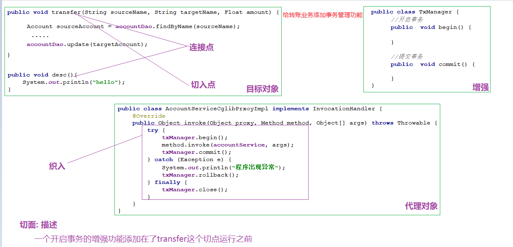

## 今日内容

+ 动态代理优化转账案例
+ AOP介绍
+ AOP入门案例
+ 配置详细解读
+ AOP工作原理
+ AOP实现事务
+ JdbcTemplate介绍
+ 声明式事务

## 第一章 使用动态代理优化转账代码

>目标对象   + 代理逻辑  = 代理对象
>
>目标对象:    被代理的对象  AccountServiceImpl
>
>代理逻辑:    要增强的功能  事务管理
>
>代理对象:     一个具有事务管理功能的Service 

### 1.jdk动态代理

#### 1.1复制一个工程

> spring > pom.xml 

```xml
<modules>
    <module>day01_01_ioc</module>
    <module>day01_02_springioc</module>
    <module>day01_03_dbutils</module>
    <module>day01_04_crud</module>
    <module>day02_01_review</module>
    <module>day02_02_anno_demo</module>
    <module>day02_03_crudanno</module>
    <module>day02_04_transfer</module>
    <module>day02_05_tx</module>
    <module>day03_01_tx_jdk</module>
</modules>
```

#### 1.2准备好目标对象

> cn.com.mryhl.service.impl.AccountServiceImpl

```java
@Repository
public class AccountServiceImpl implements AccountService {
    @Autowired
    private AccountDao accountDao;
    @Autowired
    private TxManager txManager;

    public void transfer(String sourceAccountName, String targetAccountName, Float amount) {
        Account sourceAccount = accountDao.findByName(sourceAccountName);
        Account targetAccount = accountDao.findByName(targetAccountName);
        // 内存内做金额变更
        sourceAccount.setBalance(sourceAccount.getBalance() - amount);
        targetAccount.setBalance(targetAccount.getBalance() + amount);

        // 变更后的金额提交
        accountDao.update(sourceAccount);
        // int i=1/0;
        accountDao.update(targetAccount);
    }
}
```

 

#### 1.3准备代理逻辑

> cn.com.mryhl.tx.TxManager

```java
@Component
public class TxManager {

    //本地集合
    private ThreadLocal<Connection> threadLocal = new ThreadLocal<Connection>();

    @Autowired
    private DataSource dataSource;

    //获取到Connection
    public Connection getConnection() throws SQLException {
        Connection connection = threadLocal.get();
        if (connection ** null) {
            connection = dataSource.getConnection();
            //从连接池取到连接之后要存入TH里
            threadLocal.set(connection);
        }
        return connection;
    }

    //开启事务
    public void begin(){
        try {
            getConnection().setAutoCommit(false);
        } catch (SQLException e) {
            e.printStackTrace();
        }
    }

    //提交事务
    public void commit(){
        try {
            getConnection().commit();
        } catch (SQLException e) {
            e.printStackTrace();
        }
    }

    //回滚事务
    public void rollback(){
        try {
            getConnection().rollback();
        } catch (SQLException e) {
            e.printStackTrace();
        }
    }

    //关闭事务
    public void close(){
        try {
            getConnection().close();
            threadLocal.remove();//这里千万别忘记写
        } catch (SQLException e) {
            e.printStackTrace();
        }
    }
}
```

####  1.4生成代理对象

> cn.com.mryhl.test.AccountServiceTest

```java
/**
 * 引入spring测试注解
 */
@RunWith(SpringJUnit4ClassRunner.class)
@ContextConfiguration("classpath:applicationContext.xml")
public class AccountServiceTest {
    @Autowired
    private AccountService accountService;

    /**
     * 引入事务
     */
    @Autowired
    private TxManager txManager;
    /**
     * 进行测试
     */
    @Test
    public void testTranssssfer()  {
        // 编写代理逻辑
        InvocationHandler invocationHandler = new InvocationHandler(){
            public Object invoke(Object proxy, Method method, Object[] args) throws Throwable {
                // 创建返回对象
                Object obj = null;
                try {
                    // 事务开启
                    txManager.begin();
                    // 查询两个用户的信息
                    obj = method.invoke(accountService,args);
                    // 事务提交
                    txManager.commit();
                } catch (Exception e) {
                    e.printStackTrace();
                    // 事务回滚
                    txManager.rollback();
                } finally {
                    // 事务关闭
                    txManager.close();
                }

                return obj;
            }
        };
        // 使用jdk的动态代理产生代理对象
        Proxy.newProxyInstance(
                accountService.getClass().getClassLoader(),
                accountService.getClass().getInterfaces(),
                invocationHandler
                );

        accountService.transfer("B01","B02",10f);
    }
}
```

### 2. cglib动态代理(了解)

#### 2.1复制工程

> 修改项目的pom.xml文件,引入复制的工程

```xml
<modules>
    <module>day01_01_ioc</module>
    <module>day01_02_springioc</module>
    <module>day01_03_dbutils</module>
    <module>day01_04_crud</module>
    <module>day02_01_review</module>
    <module>day02_02_anno_demo</module>
    <module>day02_03_crudanno</module>
    <module>day02_04_transfer</module>
    <module>day02_05_tx</module>
    <module>day03_01_tx_jdk</module>
    <!--新引入的项目-->
    <module>day03_02_tx_cglib</module>
</modules>
```

####  2.2去掉所有跟service接口相关的内容

> 删除service接口,及其相关的引用
>
> 1. 其实现类的实现引入
> 2. 测试文件中的多态引入

#### 2.3使用cglib创建代理对象

> 遇见问题
>
> Error:(67, 30) java: 不兼容的类型: java.lang.reflect.InvocationHandler无法转换为org.springframework.cglib.proxy.Callback
>
> 解决办法,重新导入InvocationHandler 所在的包
>
> import java.lang.reflect.InvocationHandler; -->
>
> import org.springframework.cglib.proxy.InvocationHandler;

```java
/**
 * 引入spring测试注解
 */
@RunWith(SpringJUnit4ClassRunner.class)
@ContextConfiguration("classpath:applicationContext.xml")
public class AccountServiceTest {
    @Autowired
    private AccountServiceImpl accountService;

    /**
     * 引入事务
     */
    @Autowired
    private TxManager txManager;
    /**
     * 进行测试
     */
    @Test
    public void testTransfer()  {
        // 编写代理逻辑
        InvocationHandler invocationHandler = new InvocationHandler(){
            public Object invoke(Object proxy, Method method, Object[] args) throws Throwable {
                // 创建返回对象
                Object obj = null;
                try {
                    // 事务开启
                    txManager.begin();
                    // 查询两个用户的信息
                    obj = method.invoke(accountService,args);
                    // 事务提交
                    txManager.commit();
                } catch (Exception e) {
                    e.printStackTrace();
                    // 事务回滚
                    txManager.rollback();
                } finally {
                    // 事务关闭
                    txManager.close();
                }

                return obj;
            }
        };
        // 使用Cglib的动态代理产生代理对象
        // 1. 创建一个增强器
        Enhancer enhancer = new Enhancer();
        // 2. 设置父类
        enhancer.setSuperclass(AccountServiceImpl.class);
        // 3. 设置代理逻辑
        enhancer.setCallback(invocationHandler);
        // 4. 产生代理对象
        AccountServiceImpl instance = (AccountServiceImpl) enhancer.create();


        instance.transfer("B01","B02",10f);
    }
}
```


### 3. jdk和cglib两种代理方式的选择(面试)

首先明确在创建代理实现类时，jdk的速度要高于cglib，所以选择的时候:

- 当被代理类有接口的时候，使用jdk动态代理，因为它的效率高

- 当被代理类没有接口的时候，使用cglib动态代理，因为没办法

  

### 4. 总结 

当核心业务（转账）和增强业务（事务）同时出现时，我们可以在开发时对他们分别开发，运行时再组装在一起（使用动态代理的方式）。

这样做的好处是：

1. 逻辑清晰，开发核心业务的时候，不必关注增强业务的代码
2. 代码复用性高：增强代码不用重复书写

这就是一种 AOP 的思想。 

我的总结:  **开发阶段分别开发  运行阶段组装运行**


## 第二章 AOP介绍

### 1. 概念

AOP( 面向切面编程 )是一种思想，它的目的就是在不修改源代码的基础上，对原有功能进行增强。

SpringAOP是对AOP思想的一种实现，Spring底层同时支持jdk和cglib动态代理。

Spring会根据被代理的类是否有接口自动选择代理方式：

- 如果有接口，就采用jdk动态代理(当然，也可以强制使用cglib)
- 没有接口就采用cglib的方式 

### 2. 术语(难点)

```markdown
目标对象
	被代理的对象

连接点
	被代理的对象中的所有方法

切入点
	被代理的对象中的一部分方法(要进行功能增强的部分)

增强(通知)
	一个具体的功能(打日志 开启事务  提交事务    增强类  增强方法)

织入
	将切入点代码和增强方法合在一起的动作

代理对象
	经过织入之后产生对象

切面
	切点 +  增强
	切面是一种描述, 描述了这样一件事: 一个  [什么样的增强功能]   添加在了    [哪些切点的]    [什么位置]上
	切面就是描述的切点方法和增强方法的执行顺序
```

 


## 第三章 SpringAOP的入门案例(重点)

> 需求: 在AccountServiceImpl类中的方法上打印日志
>

### 1. 思路分析

```markdown
找二配一:
	1. 目标对象
	2. 增强对象
	3. 配置切面----->生产代理对象
```

### 2. 代码开发

#### 2.1 创建一个新工程

> 引入两个坐标
>
> 1. spring坐标
> 2. 切入点表达式坐标

```xml
<?xml version="1.0" encoding="UTF-8"?>
<project xmlns="http://maven.apache.org/POM/4.0.0"
         xmlns:xsi="http://www.w3.org/2001/XMLSchema-instance"
         xsi:schemaLocation="http://maven.apache.org/POM/4.0.0 http://maven.apache.org/xsd/maven-4.0.0.xsd">
    <parent>
        <artifactId>spring</artifactId>
        <groupId>cn.com.mryhl</groupId>
        <version>1.0-SNAPSHOT</version>
    </parent>
    <modelVersion>4.0.0</modelVersion>

    <artifactId>day03_03_aop</artifactId>
    <dependencies>
        <!--spring-->
        <dependency>
            <groupId>org.springframework</groupId>
            <artifactId>spring-context</artifactId>
            <version>5.1.6.RELEASE</version>
        </dependency>
        <!--切入点表达式坐标-->
        <dependency>
            <groupId>org.aspectj</groupId>
            <artifactId>aspectjweaver</artifactId>
            <version>1.8.7</version>
        </dependency>
    </dependencies>

</project>
```

####  2.2 创建目标类(AccountServiceImpl)

> 接口

```java
/**
 * 创建service接口
 */
public interface AccountService {
    /**
     * 插入内容方法
     */
    void save(Object o);
    /**
     * 查询所有
     */
    List<Object> findAll();
    /**
     * 通过姓名查找
     */
    Object findByName(String name);
    
}
```

> 实现类

```java
/**
 * 实现类
 */
public class AccountServiceImpl implements AccountService {
    public void save(Object o) {
        System.out.println("save");

    }

    public List<Object> findAll() {
        System.out.println("findAll");
        return null;
    }

    public Object findByName(String name) {
        System.out.println("findByName");
        return null;
    }
}
```

####  2.3创建增强类(Logger)

```java
/**
 * 增强方法,打印日志
 */
public class Logger {
    /**
     * 被增强方法执行前
     */
    public void beforeMethod(){
        System.out.println(new Date()+"方法执行了..");
    }
}
```

####  2.4配置切面(重点)

```xml
<?xml version="1.0" encoding="UTF-8"?>
<beans xmlns="http://www.springframework.org/schema/beans"
       xmlns:xsi="http://www.w3.org/2001/XMLSchema-instance"
       xmlns:aop="http://www.springframework.org/schema/aop"
       xmlns:context="http://www.springframework.org/schema/context"
       xsi:schemaLocation="http://www.springframework.org/schema/beans
        https://www.springframework.org/schema/beans/spring-beans.xsd
        http://www.springframework.org/schema/aop
        https://www.springframework.org/schema/aop/spring-aop.xsd
        http://www.springframework.org/schema/context
        https://www.springframework.org/schema/context/spring-context.xsd">
    <!--目标对象-->
    <bean id="accountService" class="cn.com.mryhl.service.impl.AccountServiceImpl"></bean>
    <!--增强对象-->
    <bean id="logger" class="cn.com.mryhl.log.Logger"></bean>
    <!--aop配置-->
    <aop:config>
        <!--配置切点-->
        <aop:pointcut id="pt" expression="execution(* cn.com.mryhl.service.impl.*.*(..))"/>
        <!--配置切面-->
        <!--切面: 切点(目标对象) + 增强(增强对象)
            切面是一种描述, 描述了这样一件事: 一个  [什么样的增强功能]   添加在了    [哪些切点的]    [什么位置]上
           切面就是描述的切点方法和增强方法的执行顺序

           aspect ref="logger"  用于指定增强类   method  用于指定增强类中的一个具体增强方法
           pointcut-ref         用于指定切点
           before               增强方法在切点方法的指点运行-->
        <aop:aspect ref="logger">
            <aop:before method="beforeMethod" pointcut-ref="pt"></aop:before>
        </aop:aspect>
    </aop:config>
</beans>
```

#### 2.5测试

```java
public class AccountServiceTest {
    public static void main(String[] args) {
        ApplicationContext act = new ClassPathXmlApplicationContext("applicationContest.xml");

        AccountService accountService = act.getBean(AccountService.class);
        accountService.findAll();
    }
}
```


## 第四章 SpringAOP配置详解(重点)

### 1. 切点表达式

切点表达式的作用:  定义一组规则, 用于在连接点中挑选切点

```xml
<!--*  占位符,表示一个或多个
.. 占位符,表示零个或多个-->
<aop:pointcut id="pt" expression="execution(* cn.com.mryhl.service.impl.*.*(..))"/>
```

###  2. 四大通知

四大通知描述的就是增强方法在切点方法的什么位置上执行

- 前置通知(before) ：在切点运行之前执行
- 后置通知(after-returning)：在切点正常运行结束之后执行
- 异常通知(after-throwing)：在切点发生异常的时候执行
- 最终通知(after)：在切点的最终执行

```java
        try {
            //前置通知(before) ：在切点运行之前执行
            
            //切点执行
            
            //后置通知(after-returning)：在切点正常运行结束之后执行
            
        }catch (Exception e){
            //异常通知(after-throwing)：在切点发生异常的时候执行
            
        }finally {
            //最终通知(after)：在切点的最终执行
        }
```

#### 2.1添加方法

```java
/**
 * 增强方法,打印日志
 */
public class Logger {
    /**
     * 被增强方法执行前
     */
    public void beforeMethod(){
        System.out.println(new Date()+"方法开始执行了..");
    }

    /**
     * 被增强方法正常执行完成
     */
    public void afterReturnMethod(){
        System.out.println(new Date()+"方法执行完成了..");
    }

    /**
     * 被增强方法出现异常
     */
    public void afterThrowMethod(){
        System.out.println(new Date()+"方法出现异常了..");
    }
    /**
     * 被增强方法到最后
     */
    public void afterMethod(){
        System.out.println(new Date()+"方法执行到最后..");
    }
}
```

#### 2.2添加配置

```xml
<aop:aspect ref="logger">
    <aop:before method="beforeMethod" pointcut-ref="pt"></aop:before>
    <aop:after-returning method="afterReturnMethod" pointcut-ref="pt"></aop:after-returning>
    <aop:after-throwing method="afterThrowMethod" pointcut-ref="pt"></aop:after-throwing>
    <aop:after method="afterMethod" pointcut-ref="pt"></aop:after>
</aop:aspect>
```

 

**当四大通知同时出现的时候, 它的执行顺序会受到配置顺序的影响**

### 3. 环绕通知

它是一种特殊的通知，他允许你以编码的形式实现四大通知

#### 3.1编码

> 传入参数 ProceedingJoinPoint pjp
>
> 切点执行
>
> pjp.proceed();

```java
/**
 * 环绕通知
 */
public void aroundMethod(ProceedingJoinPoint pjp){
    try {
        System.out.println("即将执行方法.......");

        //切点执行
        pjp.proceed();

        System.out.println("方法正常结束.......");

    }catch (Throwable e){
        e.printStackTrace();
        System.out.println("方法出现异常.......");

    }finally {
        System.out.println("方法运行到最后.......");
    }
}
```

 

#### 3.2配置

```xml
<aop:aspect ref="logger">
    <!--<aop:before method="beforeMethod" pointcut-ref="pt"></aop:before>
    <aop:after-returning method="afterReturnMethod" pointcut-ref="pt"></aop:after-returning>
    <aop:after-throwing method="afterThrowMethod" pointcut-ref="pt"></aop:after-throwing>
    <aop:after method="afterMethod" pointcut-ref="pt"></aop:after>-->
    <aop:around method="aroundMethod" pointcut-ref="pt"></aop:around>
</aop:aspect>
```

 


## 第五章 AOP工作原理(面试)

### 1. 开发阶段(开发者完成)

开发共性功能，制作成增强

开发非共性功能，制作成切点

在配置文件中，声明切点与增强间的关系，即切面

### 2. 容器启动阶段(AOP完成)

Spring读取配置文件中的切面信息，根据切面中的描述, 将**增强功能**增加在**目标对象的切点方法**上，动态创建代理对象, 最后将代理对象放入容器中 

>面试题:
>
>1. 正向面试 : 1) 日志处理  2) 事务   3) 性能统计
>2. 反向面试：


## 第六章 SpringAOP注解版(重点)

### 1. 环境准备

#### 1.1 复制工程

```xml
<modules>
    <module>day01_01_ioc</module>
    <module>day01_02_springioc</module>
    <module>day01_03_dbutils</module>
    <module>day01_04_crud</module>
    <module>day02_01_review</module>
    <module>day02_02_anno_demo</module>
    <module>day02_03_crudanno</module>
    <module>day02_04_transfer</module>
    <module>day02_05_tx</module>
    <module>day03_01_tx_jdk</module>
    <module>day03_02_tx_cglib</module>
    <module>day03_03_aop</module>
    <!--引入新的文件-->
    <module>day03_03_aop_anno</module>
</modules>
```

 

#### 1.2 添加组件扫描

```xml
<!--组件扫描-->
<context:component-scan base-package="cn.com.mryhl"></context:component-scan>

<!--目标对象-->
<!--<bean id="accountService" class="cn.com.mryhl.service.impl.AccountServiceImpl"></bean>-->
<!--增强对象-->
<!--<bean id="logger" class="cn.com.mryhl.log.Logger"></bean>-->
```

 

#### 1.3 将AccountServiceImpl变成注解

```java
/**
 * 实现类
 * 加入注解
 */
@Service
public class AccountServiceImpl implements AccountService {
    public void save(Object o) {
        System.out.println("save");

    }

    public List<Object> findAll() {
        System.out.println("findAll");
        return null;
    }

    public Object findByName(String name) {
        System.out.println("findByName");
        return null;
    }
}
```

 

#### 1.4 将Logger变成注解

```java
/**
 * 增强方法,打印日志
 * 加入注解
 */
@Component
public class Logger {
    /**
     * 环绕通知
     */
    public void aroundMethod(ProceedingJoinPoint pjp){
        try {
            System.out.println("即将执行方法.......");

            //切点执行
            pjp.proceed();

            System.out.println("方法正常结束.......");

        }catch (Throwable e){
            e.printStackTrace();
            System.out.println("方法出现异常.......");

        }finally {
            System.out.println("方法运行到最后.......");
        }
    }
    /**
     * 被增强方法执行前
     */
    public void beforeMethod(){
        System.out.println(new Date()+"方法开始执行了..");
    }

    /**
     * 被增强方法正常执行完成
     */
    public void afterReturnMethod(){
        System.out.println(new Date()+"方法执行完成了..");
    }

    /**
     * 被增强方法出现异常
     */
    public void afterThrowMethod(){
        System.out.println(new Date()+"方法出现异常了..");
    }
    /**
     * 被增强方法到最后
     */
    public void afterMethod(){
        System.out.println(new Date()+"方法执行到最后..");
    }
}
```

 

### 2.  四大通知

>将切面转移到增强类上

#### 2.1 激活切面自动代理

```xml
<!--激活切面自动代理-->
<aop:aspectj-autoproxy></aop:aspectj-autoproxy>
```

####  2.2 定义切面

```java
/**
 * 增强方法,打印日志
 * 加入注解
 * @Aspect声明这是一个切面
 */
@Component
@Aspect
public class Logger {
    /**
     * 定义切面表达式
     */
    @Pointcut("execution(* cn.com.mryhl.service.impl.*.*(..))")
    public void pt(){};
    /**
     * 环绕通知
     */
    public void aroundMethod(ProceedingJoinPoint pjp){
        try {
            System.out.println("即将执行方法.......");

            //切点执行
            pjp.proceed();

            System.out.println("方法正常结束.......");

        }catch (Throwable e){
            e.printStackTrace();
            System.out.println("方法出现异常.......");

        }finally {
            System.out.println("方法运行到最后.......");
        }
    }
    /**
     * 被增强方法执行前
     */
    @Before("pt()")
    public void beforeMethod(){
        System.out.println(new Date()+"方法开始执行了..");
    }

    /**
     * 被增强方法正常执行完成
     */
    public void afterReturnMethod(){
        System.out.println(new Date()+"方法执行完成了..");
    }

    /**
     * 被增强方法出现异常
     */
    public void afterThrowMethod(){
        System.out.println(new Date()+"方法出现异常了..");
    }
    /**
     * 被增强方法到最后
     */
    public void afterMethod(){
        System.out.println(new Date()+"方法执行到最后..");
    }
}
```

 2.3 测试

```java
public class AccountServiceTest {
    public static void main(String[] args) {
        ApplicationContext act = new ClassPathXmlApplicationContext("applicationContest.xml");

        AccountService accountService = act.getBean(AccountService.class);
        accountService.findAll();
    }
}
```

> Fri Sep 25 19:58:38 CST 2020方法开始执行了..
> findAll

**四大通知同时出现的时候,注解版会有顺序问题, 不能用**

### 3. 环绕通知

```java
/**
 * 环绕通知
 */
@Around("pt()")
public void aroundMethod(ProceedingJoinPoint pjp){
    try {
        System.out.println("即将执行方法.......");

        //切点执行
        pjp.proceed();

        System.out.println("方法正常结束.......");

    }catch (Throwable e){
        e.printStackTrace();
        System.out.println("方法出现异常.......");

    }finally {
        System.out.println("方法运行到最后.......");
    }
}
```


> 即将执行方法.......
> 		findAll
> 		方法正常结束.......
> 		方法运行到最后.......

### 4. 纯注解版

#### 4.1 提取配置

```java
@ComponentScan("cn.com.mryhl")
/**
 * 自动激活代理
 */
@EnableAspectJAutoProxy 
public class SpringConfig {
}
```

 

#### 4.2测试

```java
public class AccountServiceTest {
    public static void main(String[] args) {
        // ApplicationContext act = new ClassPathXmlApplicationContext("applicationContest.xml");
        ApplicationContext act = new AnnotationConfigApplicationContext(SpringConfig.class);

        AccountService accountService = act.getBean(AccountService.class);
        accountService.findAll();
    }
}
```

 


## 第七章 SpringAOP实现事务管理

### 1. 准备工作

#### 1.1 复制一个工程

> 导入aspectjweaver坐标

```xml
<dependencies>
    <!--aspectj-->
    <dependency>
        <groupId>org.aspectj</groupId>
        <artifactId>aspectjweaver</artifactId>
        <version>1.8.7</version>
    </dependency>
    <!--mysql-->
    <dependency>
        <groupId>mysql</groupId>
        <artifactId>mysql-connector-java</artifactId>
        <version>5.1.6</version>
    </dependency>
    <!--druid-->
    <dependency>
        <groupId>com.alibaba</groupId>
        <artifactId>druid</artifactId>
        <version>1.1.15</version>
    </dependency>
    <dependency>
        <groupId>commons-dbutils</groupId>
        <artifactId>commons-dbutils</artifactId>
        <version>1.7</version>
    </dependency>
    <!--spring-->
    <dependency>
        <groupId>org.springframework</groupId>
        <artifactId>spring-context</artifactId>
        <version>5.1.6.RELEASE</version>
    </dependency>
    <!--junit-->
    <dependency>
        <groupId>junit</groupId>
        <artifactId>junit</artifactId>
        <version>4.12</version>
    </dependency>
    <dependency>
        <groupId>org.springframework</groupId>
        <artifactId>spring-test</artifactId>
        <version>5.1.6.RELEASE</version>
    </dependency>
</dependencies>
```

 

#### 1.2 准备目标对象

```java
@Service
public class AccountServiceImpl implements AccountService {
    @Autowired
    private AccountDao accountDao;
    @Autowired
    private TxManager txManager;

    public void transfer(String sourceAccountName, String targetAccountName, Float amount) {
            // 查询两个用户的信息
            Account sourceAccount = accountDao.findByName(sourceAccountName);
            Account targetAccount = accountDao.findByName(targetAccountName);
            // 内存内做金额变更
            sourceAccount.setBalance(sourceAccount.getBalance() - amount);
            targetAccount.setBalance(targetAccount.getBalance() + amount);

            // 变更后的金额提交
            accountDao.update(sourceAccount);
            // int i=1/0;
            accountDao.update(targetAccount);
            
    }
}
```

 

#### 1.3 准备增强对象

```java
package cn.com.mryhl.tx;

import org.springframework.beans.factory.annotation.Autowired;
import org.springframework.stereotype.Component;

import javax.sql.DataSource;
import java.sql.Connection;
import java.sql.SQLException;

@Component
public class TxManager {

    //本地集合
    private ThreadLocal<Connection> threadLocal = new ThreadLocal<Connection>();

    @Autowired
    private DataSource dataSource;

    //获取到Connection
    public Connection getConnection() throws SQLException {
        Connection connection = threadLocal.get();
        if (connection == null) {
            connection = dataSource.getConnection();
            //从连接池取到连接之后要存入TH里
            threadLocal.set(connection);
        }
        return connection;
    }

    //开启事务
    public void begin(){
        try {
            getConnection().setAutoCommit(false);
        } catch (SQLException e) {
            e.printStackTrace();
        }
    }

    //提交事务
    public void commit(){
        try {
            getConnection().commit();
        } catch (SQLException e) {
            e.printStackTrace();
        }
    }

    //回滚事务
    public void rollback(){
        try {
            getConnection().rollback();
        } catch (SQLException e) {
            e.printStackTrace();
        }
    }

    //关闭事务
    public void close(){
        try {
            getConnection().close();
            threadLocal.remove();//这里千万别忘记写
        } catch (SQLException e) {
            e.printStackTrace();
        }
    }
}
```

 

### 2. XML版本

#### 2.1 四大通知版

```xml
<aop:config>
    <!--切点-->
    <aop:pointcut id="pt" expression="execution(* cn.com.mryhl.service.impl.*.*(..))"/>
    <!--切面-->
    <aop:aspect ref="txManager">
        <aop:before method="begin" pointcut-ref="pt"></aop:before>
        <aop:after-returning method="commit" pointcut-ref="pt"></aop:after-returning>
        <aop:after-throwing method="rollback" pointcut-ref="pt"></aop:after-throwing>
        <aop:after method="close" pointcut-ref="pt"></aop:after>
    </aop:aspect>
</aop:config>
```

 

#### 2.2 环绕通知

```java
/**
 * 环绕通知
 */

public void handlerTx(ProceedingJoinPoint pjp){
    try{
        getConnection().setAutoCommit(false);
        pjp.proceed();
        getConnection().commit();
        
    }catch (Throwable e){
        e.printStackTrace();
        try {
            getConnection().rollback();
        } catch (SQLException k) {
            k.printStackTrace();
        }
    }finally {
        try {
            getConnection().close();
            threadLocal.remove();//这里千万别忘记写
        } catch (SQLException e) {
            e.printStackTrace();
        }
    }
}
```

```xml
<aop:config>
    <!--切点-->
    <aop:pointcut id="pt" expression="execution(* cn.com.mryhl.service.impl.*.*(..))"/>
    <!--切面-->
    <aop:aspect ref="txManager">
        <!--<aop:before method="begin" pointcut-ref="pt"></aop:before>-->
        <!--<aop:after-returning method="commit" pointcut-ref="pt"></aop:after-returning>-->
        <!--<aop:after-throwing method="rollback" pointcut-ref="pt"></aop:after-throwing>-->
        <!--<aop:after method="close" pointcut-ref="pt"></aop:after>-->
        <aop:around method="handlerTx" pointcut-ref="pt"></aop:around>
    </aop:aspect>
</aop:config>
```

 

### 3. 注解版本

#### 3.1 注释掉xml中aop:config

```xml
<!--    <aop:config>
        &lt;!&ndash;切点&ndash;&gt;
        <aop:pointcut id="pt" expression="execution(* cn.com.mryhl.service.impl.*.*(..))"/>
        &lt;!&ndash;切面&ndash;&gt;
        <aop:aspect ref="txManager">
            &lt;!&ndash;<aop:before method="begin" pointcut-ref="pt"></aop:before>&ndash;&gt;
            &lt;!&ndash;<aop:after-returning method="commit" pointcut-ref="pt"></aop:after-returning>&ndash;&gt;
            &lt;!&ndash;<aop:after-throwing method="rollback" pointcut-ref="pt"></aop:after-throwing>&ndash;&gt;
            &lt;!&ndash;<aop:after method="close" pointcut-ref="pt"></aop:after>&ndash;&gt;
            <aop:around method="handlerTx" pointcut-ref="pt"></aop:around>
        </aop:aspect>
    </aop:config>-->
```

####  3.2 激活切面自动代理

```xml
<aop:aspectj-autoproxy></aop:aspectj-autoproxy>
```

#### 3.3 在增强类中配置切面

```java
@Around("execution(* cn.com.mryhl.service.impl.*.*(..))")
public void handlerTx(ProceedingJoinPoint pjp){
    try{
        getConnection().setAutoCommit(false);
        pjp.proceed();
        getConnection().commit();

    }catch (Throwable e){
        e.printStackTrace();
        try {
            getConnection().rollback();
        } catch (SQLException k) {
            k.printStackTrace();
        }
    }finally {
        try {
            getConnection().close();
            threadLocal.remove();//这里千万别忘记写
        } catch (SQLException e) {
            e.printStackTrace();
        }
    }
}
```

 

#### 3.4 测试

> 事务成功


## 第八章 JdbcTemplate介绍(会用)

### 1. JdbcTemplate介绍

JdbcTemplate是Spring提供的持久层技术，用于操作数据库，它底层封装了JDBC技术。

核心类：

- JdbcTemplate  用于执行增删改查的SQL语句 (QueryRunner)
- RowMapper  这是一个接口，主要作用是将数据库返回的记录封装进实体对象(ResultHandler)

核心方法：

- update()  用来执行增、删、改语句
- query()    用来执行查询语句

```java
//创建一个JdbcTemplate对象，用来执行增删改查, 需要给一个数据源
JdbcTemplate  jdbcTemplate = new JdbcTemplate(dataSource);

//update方法，用于执行增删改语句
//第一个参数:sql语句   后面的参数:sql语句中的所需要的的值
jdbcTemplate.update("insert into account value(null,?,?)",1,2);

//query或者queryForObject方法，用于执行查询语句
//query 用于查询多条记录,返回一个集合   queryForObject用于查询一条记录,返回一个实体
//第一个参数:sql语句   第二个参数:封装返回值   后面的参数:sql语句中的所需要的的值
jdbcTemplate.query("select * from account", new BeanPropertyRowMapper<Account>(Account.class)); 
jdbcTemplate.queryForObject("select * from account where aid = ?",  new BeanPropertyRowMapper<Account>(Account.class),  1);
```

### 2. JdbcTemplate案例

使用JdbcTemplate完成一个crud+转账的案例(常用注解版)

#### 2.1 准备数据环境

 

| aid  | name | balance |
| ---- | ---- | ------- |
| 1    | B01  | 100.00  |
| 2    | B02  | 100.00  |


#### 2.2 创建一个工程,导入依赖

```xml
    <dependencies>
        <!--mysql-->
        <dependency>
            <groupId>mysql</groupId>
            <artifactId>mysql-connector-java</artifactId>
            <version>5.1.6</version>
        </dependency>
        <!--druid-->
        <dependency>
            <groupId>com.alibaba</groupId>
            <artifactId>druid</artifactId>
            <version>1.1.15</version>
        </dependency>
        <!--spring-jdbc-->
        <dependency>
            <groupId>org.springframework</groupId>
            <artifactId>spring-jdbc</artifactId>
            <version>5.1.6.RELEASE</version>
        </dependency>
        <!--spring-context-->
        <dependency>
            <groupId>org.springframework</groupId>
            <artifactId>spring-context</artifactId>
            <version>5.1.6.RELEASE</version>
        </dependency>
        <!--aspectjweaver-->
        <dependency>
            <groupId>org.aspectj</groupId>
            <artifactId>aspectjweaver</artifactId>
            <version>1.8.7</version>
        </dependency>
        <!--junit-->
        <dependency>
            <groupId>junit</groupId>
            <artifactId>junit</artifactId>
            <version>4.12</version>
        </dependency>
        <!--spring-test-->
        <dependency>
            <groupId>org.springframework</groupId>
            <artifactId>spring-test</artifactId>
            <version>5.1.6.RELEASE</version>
        </dependency>
    </dependencies>
```

#### 2.3 创建实体类

```java
package cn.com.mryhl.domain;

public class Account {
    private Integer aid;
    private String name;
    private Float balance;

    public Integer getAid() {
        return aid;
    }

    public void setAid(Integer aid) {
        this.aid = aid;
    }

    public String getName() {
        return name;
    }

    public void setName(String name) {
        this.name = name;
    }

    public Float getBalance() {
        return balance;
    }

    public void setBalance(Float balance) {
        this.balance = balance;
    }

    @Override
    public String toString() {
        return "Account{" +
                "aid=" + aid +
                ", name='" + name + '\'' +
                ", balance=" + balance +
                '}';
    }
}
```

 

#### 2.4 创建dao接口

```java
public interface AccountDao {
    /**
     * 保存
     */
    void save(Account account);

    /**
     * 查询所有
     */
    List<Account> findAll();

    /**
     * 根据name查询
     */
    Account findByName(String name);

    /**
     * 根据name修改
     */
    void update(Account account);

    /**
     * 删除
     */
    void deleByName(String name);
}
```

 

#### 2.5 创建dao实现类

```java
@Repository
public class AccountDaoImpl implements AccountDao {
    @Autowired
    private JdbcTemplate jdbcTemplate;


    public void save(Account account) {

        jdbcTemplate.update("insert into account values(null,?,?)", account.getName(), account.getBalance());

    }

    public List<Account> findAll() {

        return jdbcTemplate.query("select * from account", new BeanPropertyRowMapper<Account>(Account.class));

    }

    public Account findByName(String name) {

        return jdbcTemplate.queryForObject("select * from account where name = ?", new BeanPropertyRowMapper<Account>(Account.class), name);


    }

    public void update(Account account) {

        jdbcTemplate.update("update account set balance = ? where name = ?", account.getBalance(), account.getName());

    }

    public void deleByName(String name) {

        jdbcTemplate.update("delete from account where name = ?", name);
    }


}
```

 

#### 2.6 创建service接口

```java
public interface AccountService {
    /**
     * 保存
     */
    void save(Account account);

    /**
     * 查询所有
     */
    List<Account> findAll();

    /**
     * 根据name查询
     */
    Account findByName(String name);

    /**
     * 根据name修改
     */
    void update(Account account);

    /**
     * 删除
     */
    void deleByName(String name);
}
```

 

#### 2.7 创建service实现类

```java
public void transfer(String sourceAccountName, String targetAccountName, Float amount) {
    // 查询两个用户的信息
    Account sourceAccount = accountDao.findByName(sourceAccountName);
    Account targetAccount = accountDao.findByName(targetAccountName);
    // 内存内做金额变更
    sourceAccount.setBalance(sourceAccount.getBalance() - amount);
    targetAccount.setBalance(targetAccount.getBalance() + amount);

    // 变更后的金额提交
    accountDao.update(sourceAccount);
    // int i=1/0;
    accountDao.update(targetAccount);

}
```

 

#### 2.8 加入Spring的配置文件

```xml
<?xml version="1.0" encoding="UTF-8"?>
<beans xmlns="http://www.springframework.org/schema/beans"
       xmlns:p="http://www.springframework.org/schema/p"
       xmlns:xsi="http://www.w3.org/2001/XMLSchema-instance"
       xmlns:context="http://www.springframework.org/schema/context"
       xmlns:aop="http://www.springframework.org/schema/aop"
       xsi:schemaLocation="http://www.springframework.org/schema/beans
             http://www.springframework.org/schema/beans/spring-beans.xsd
             http://www.springframework.org/schema/context
             http://www.springframework.org/schema/context/spring-context.xsd http://www.springframework.org/schema/aop http://www.springframework.org/schema/aop/spring-aop.xsd">
    <!--组件扫描-->
    <context:component-scan base-package="cn.com.mryhl"/>

    <!--dataSource-->
    <bean id="dataSource" class="com.alibaba.druid.pool.DruidDataSource">
        <property name="driverClassName" value="com.mysql.jdbc.Driver"/>
        <property name="url" value="jdbc:mysql:///spring"/>
        <property name="username" value="root"/>
        <property name="password" value="root"/>
    </bean>

    <!--JdbcTemplate-->
    <bean id="jdbcTemplate" class="org.springframework.jdbc.core.JdbcTemplate">
        <property name="dataSource" ref="dataSource"></property>
    </bean>
</beans>
```

 

#### 2.9 测试

```java
@RunWith(SpringJUnit4ClassRunner.class)
@ContextConfiguration("classpath:applicationContext.xml")
public class AccountServiceTest {
    @Autowired
    private AccountService accountService;
    
    /**
     * 
     */
    @Test
    public void test01(){
        accountService.transfer("B01","B02",10f);       
    }

}
```

 


##  第九章 Spring中的事务管理(了解)

### 1. 事务管理方式

Spring支持两种事务管理方式：编程式事务和声明式事务

- 编程式事务就是将业务代码和事务代码放在一起书写，它的耦合性太高，开发中不使用

- 声明式事务其实就是将事务代码和业务代码隔离开发，然后通过一段配置让他们组装运行，最后达到事务控制的目的


声明式事务就是通过AOP原理实现的

### 2. Spring事务管理相关的API

#### 2.1 PlatformTransactionManager 

PlatformTransactionManager这是Spring进行事务管理的一个根接口，我们要使用它的实现类做事务管理

**我们需要知道的是:mybatis和jdbcTemplate都可以使用它的一个子类(DataSourceTransactionManager)做事务管理**

#### 2.2 TransactionDefinition

TransactionDefinition这个API是用来做事务定义的

| 内容                                                         | 分类         |
| ------------------------------------------------------------ | ------------ |
| is ReadOnly0 : boolean                                       | 事务是否只读 |
| ISOLATION_DEFAULT : int = - 1<br/>ISOLATION_READ_COMMITTED:int=2<br/>ISOLATION_READ_UNCOMMITTED:int=1<br/>ISOLATION_REPEATABLE_READ:int=4<br/>ISOLATION_SERIALIZABLE:int=8 | 事务隔离级别 |
| PROPAGATION MANDATORY : int = 2<br/>PROPAGATION NESTED : int = 6<br/>PROPAGATION NEVER : int = 5<br/>PROPAGATION NOT SUPPORTED: int=4<br/>PROPAGATION REQUIRED:int=0<br/>PROPAGATION_REQUIRES_NEW:int=3<br/>PROPAGATION SUPPORTS : int = 1 | 事务传播行为 |
| TIMEOUT_DEFAULT:int=-1                                       | 事务超时时长 |

##### 2.3 隔离级别

>事务隔离级别相关【不设置事务隔离级别，可能引发脏读、不可重复读、虚读】
>
>+ ISOLATION_READ_UNCOMMITTED读未提交
>
>+ ISOLATION_READ_COMMITTED读已提交
>
>+ ISOLATION_REPEATABLE_READ可重复度
>
>+ ISOLATION_SERIALIZABLE串行化
>
>  mysq1支持四种，默认可重复度
>  oracle支持两种（读已提交和串行化）,默认是读已提交

 

##### 2.4 传播行为

事务传播行为指的就是当一个业务方法【被】另一个业务方法调用时，应该如何进行事务控制 

```java
a(){
    
    b();// b必须有事务才可以运行
}


b(){}
```

> + PROPAGATION_REQUIRED(必须有事务，这是默认值）
>   如果存在一个事务，则加入到当前事务。如果没有事务则开启一个新的事务。
> + PROPAGATION_REQUIRES_NEW(必须有新的）
>   总是开启一个新的事务。如果存在一个事务，则将这个存在的事务挂起，再来一个新的。
> + PROPAGATION_SUPPORTS(支持有事务）
>   如果存在一个事务，则加入到当前事务。如果没有事务则非事务运行。
> + PROPAGATION_NOT_SUPPORTED(不支持有事务）
>   总是非事务地执行，并挂起任何存在的事务。
>
> + PROPAGATION_MANDATORY(强制有事务，自己还不负责创建）
>   如果存在一个事务，则加入到当前事务。如果没有事务，则抛出异常。
> + PROPAGATION_NEVER(强制不要事务，自己还不负责挂起）:
>   总是非事务地执行,如果存在一个活动事务,则抛出异常


##### 2.4.1只读性

只读事务(增 删  改不能使用,只能查询使用)

换句话说,只读事务只能用于查询方法

##### 2.4.2 超时时长

事务超时时间, 此属性需要底层数据库的支持

它的默认值是-1, 代表不限制

#### 2.5TransactionStatus

TransactionStatus代表的是事务的当前状态

#### 2.6 三个API之间的关系

PlatformTransactionManager通过读取TransactionDefinition中定义事务信息参数,来管理事务,

管理之后会产生一些列的TransactionStatus


## 第十章 声明式事务(重点)

### 1. 思路

目标对象:  业务层的所有对象   **自己开发**

增强对象:  事务管理器 (DataSourceTransactionManager) 

​                **需要我们给它传递一批参数(事务隔离级别  传播行为  超时时长  只读)**

配置切面:  配置的是切点和增强的关系   **自己配置**

### 2. xml版(重点)

#### 2.1 复制工程

 

```xml
<modules>
    <module>day01_01_ioc</module>
    <module>day01_02_springioc</module>
    <module>day01_03_dbutils</module>
    <module>day01_04_crud</module>
    <module>day02_01_review</module>
    <module>day02_02_anno_demo</module>
    <module>day02_03_crudanno</module>
    <module>day02_04_transfer</module>
    <module>day02_05_tx</module>
    <module>day03_01_tx_jdk</module>
    <module>day03_02_tx_cglib</module>
    <module>day03_03_aop</module>
    <module>day03_04_aop_anno</module>
    <module>day03_05_tx_springaop</module>
    <module>day03_06_jt</module>
    <module>day03_07_jt_tx_xml</module>
</modules>
```

#### 2.2 准备目标对象

```java
@Service
public class AccountServiceImpl implements AccountService {

    @Autowired
    private AccountDao accountDao;

    public void transfer(String sourceAccountName, String targetAccountName, Float amount) {
        // 查询两个用户的信息
        Account sourceAccount = accountDao.findByName(sourceAccountName);
        Account targetAccount = accountDao.findByName(targetAccountName);
        // 内存内做金额变更
        sourceAccount.setBalance(sourceAccount.getBalance() - amount);
        targetAccount.setBalance(targetAccount.getBalance() + amount);

        // 变更后的金额提交
        accountDao.update(sourceAccount);
        // int i=1/0;
        accountDao.update(targetAccount);

    }

    public void save(Account account) {
        accountDao.save(account);
    }

    public List<Account> findAll() {
        return accountDao.findAll();
    }

    public Account findByName(String name) {
        return accountDao.findByName(name);
    }

    public void update(Account account) {
        accountDao.update(account);
    }


    public void deleByName(String name) {
        accountDao.deleByName(name);
    }
}
```

 

#### 2.3 配置事务管理器的参数和切面

```xml
<?xml version="1.0" encoding="UTF-8"?>
<beans xmlns="http://www.springframework.org/schema/beans"
       xmlns:p="http://www.springframework.org/schema/p"
       xmlns:xsi="http://www.w3.org/2001/XMLSchema-instance"
       xmlns:context="http://www.springframework.org/schema/context"
       xmlns:aop="http://www.springframework.org/schema/aop" xmlns:tx="http://www.springframework.org/schema/tx"
       xsi:schemaLocation="http://www.springframework.org/schema/beans
             http://www.springframework.org/schema/beans/spring-beans.xsd
             http://www.springframework.org/schema/context
             http://www.springframework.org/schema/context/spring-context.xsd http://www.springframework.org/schema/aop http://www.springframework.org/schema/aop/spring-aop.xsd http://www.springframework.org/schema/tx http://www.springframework.org/schema/tx/spring-tx.xsd">
    <!--组件扫描-->
    <context:component-scan base-package="cn.com.mryhl"/>

    <!--dataSource-->
    <bean id="dataSource" class="com.alibaba.druid.pool.DruidDataSource">
        <property name="driverClassName" value="com.mysql.jdbc.Driver"/>
        <property name="url" value="jdbc:mysql:///spring"/>
        <property name="username" value="root"/>
        <property name="password" value="root"/>
    </bean>

    <!--JdbcTemplate-->
    <bean id="jdbcTemplate" class="org.springframework.jdbc.core.JdbcTemplate">
        <property name="dataSource" ref="dataSource"></property>
    </bean>
    <!--事务管理器-->
    <bean id="transactionManager"
          class="org.springframework.jdbc.datasource.DataSourceTransactionManager">
        <property name="dataSource" ref="dataSource"/>
    </bean>
    <tx:advice id="txAdvice" transaction-manager="transactionManager">
        <tx:attributes>
            <tx:method name="find*" read-only="true"></tx:method>
            <tx:method name="*"/>
        </tx:attributes>
    </tx:advice>
    <aop:config>
        <aop:pointcut id="pt" expression="execution(* cn.com.mryhl.service.impl.*.*(..))"/>
        <aop:advisor advice-ref="txAdvice" pointcut-ref="pt"></aop:advisor>
    </aop:config>
</beans>
```

 

#### 2.4 事务管理器参数的配置

```markdown
<tx:attributes>
<!--控制查询方法, 事务是只读的-->
<!--
name作用是在所有的切点中进行二次匹配, 通过规则挑选一部分  这个匹配从上往下执行的,一旦匹配到一个,就不再匹配下面的了
isolation="DEFAULT"  设置隔离级别
propagation="REQUIRED"  设置传播行为
timeout="-1"    设置超时时间
read-only="false"    设置是否只读
rollback-for=""       只针对什么异常回滚
no-rollback-for=""    对于哪个异常不回滚
-->
<tx:method name="find*" read-only="true"/>
<tx:method name="*"/>
</tx:attributes>
```

 

### 3. 注解版(重点)

#### 3.1 复制工程

```xml
<modules>
    <module>day01_01_ioc</module>
    <module>day01_02_springioc</module>
    <module>day01_03_dbutils</module>
    <module>day01_04_crud</module>
    <module>day02_01_review</module>
    <module>day02_02_anno_demo</module>
    <module>day02_03_crudanno</module>
    <module>day02_04_transfer</module>
    <module>day02_05_tx</module>
    <module>day03_01_tx_jdk</module>
    <module>day03_02_tx_cglib</module>
    <module>day03_03_aop</module>
    <module>day03_04_aop_anno</module>
    <module>day03_05_tx_springaop</module>
    <module>day03_06_jt</module>
    <module>day03_07_jt_tx_xml</module>
    <module>day03_08_jt_tx_anno</module>
</modules>
```

 

#### 3.2 删除aop:config和tx:advice的配置

```xml
<!--<tx:advice id="txAdvice" transaction-manager="transactionManager">
    <tx:attributes>
        <tx:method name="find*" read-only="true"></tx:method>
        <tx:method name="*"/>
    </tx:attributes>
</tx:advice>
<aop:config>
    <aop:pointcut id="pt" expression="execution(* cn.com.mryhl.service.impl.*.*(..))"/>
    <aop:advisor advice-ref="txAdvice" pointcut-ref="pt"></aop:advisor>
</aop:config>-->
```

#### 3.3 开启注解驱动

```xml
<!--开启注解驱动-->
<tx:annotation-driven></tx:annotation-driven>
```

####  3.4 在目标对象中添加事务管理注解

```java
@Service
@Transactional // 表示当前类具有事务管理功能
public class AccountServiceImpl implements AccountService {

    @Autowired
    private AccountDao accountDao;
    @Transactional(
            readOnly = false,
            isolation = Isolation.DEFAULT,
            propagation = Propagation.REQUIRED,
            timeout = -1
    )
    public void transfer(String sourceAccountName, String targetAccountName, Float amount) {
        // 查询两个用户的信息
        Account sourceAccount = accountDao.findByName(sourceAccountName);
        Account targetAccount = accountDao.findByName(targetAccountName);
        // 内存内做金额变更
        sourceAccount.setBalance(sourceAccount.getBalance() - amount);
        targetAccount.setBalance(targetAccount.getBalance() + amount);

        // 变更后的金额提交
        accountDao.update(sourceAccount);
        // int i=1/0;
        accountDao.update(targetAccount);

    }

    public void save(Account account) {
        accountDao.save(account);
    }

    public List<Account> findAll() {
        return accountDao.findAll();
    }

    public Account findByName(String name) {
        return accountDao.findByName(name);
    }

    public void update(Account account) {
        accountDao.update(account);
    }


    public void deleByName(String name) {
        accountDao.deleByName(name);
    }
}
```

 

### 4. 纯注解版(了解)

#### 4.1转移配置到配置类

```java
package cn.com.mryhl.config;

import com.alibaba.druid.pool.DruidDataSource;
import org.springframework.context.annotation.Bean;
import org.springframework.context.annotation.ComponentScan;
import org.springframework.context.annotation.EnableAspectJAutoProxy;
import org.springframework.jdbc.core.JdbcTemplate;
import org.springframework.jdbc.datasource.DataSourceTransactionManager;


import javax.sql.DataSource;
@ComponentScan("cn.com.mryhl")
@EnableAspectJAutoProxy
public class SpringConifg {
    @Bean
    public DataSource dataSource(){
        DruidDataSource dataSource = new DruidDataSource();
        dataSource.setDriverClassName("com.mysql.jdbc.Driver");
        dataSource.setUrl("jdbc:mysql:///spring");
        dataSource.setUsername("root");
        dataSource.setPassword("root");
        return dataSource;
    }

    @Bean
    public JdbcTemplate jdbcTemplate(DataSource dataSource){
        return new JdbcTemplate(dataSource);
    }

    @Bean
    public DataSourceTransactionManager transactionManager(DataSource dataSource){
        DataSourceTransactionManager manager = new DataSourceTransactionManager();
        manager.setDataSource(dataSource);
        return manager;
    }
}
```

 

####  4.2 测试

```java
/**
 * 引入spring测试注解
 */
@RunWith(SpringJUnit4ClassRunner.class)
// @ContextConfiguration("classpath:applicationContext.xml")
@ContextConfiguration(classes= SpringConifg.class)
public class AccountServiceTest {
    @Autowired
    private AccountService accountService;

    /**
     *
     */
    @Test
    public void test01(){
        accountService.transfer("B01","B02",10f);
    }

}
```

 