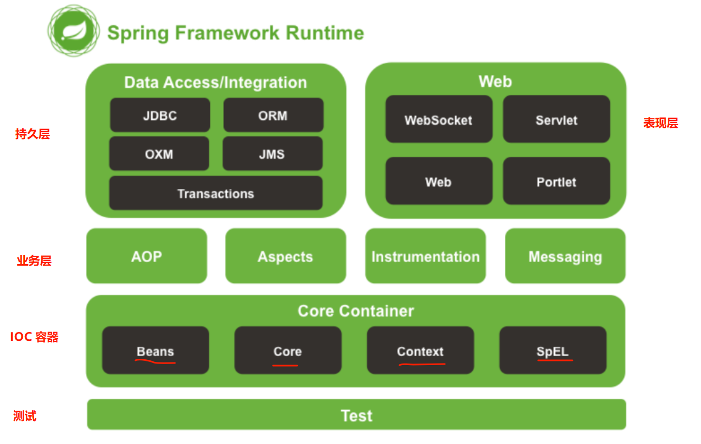
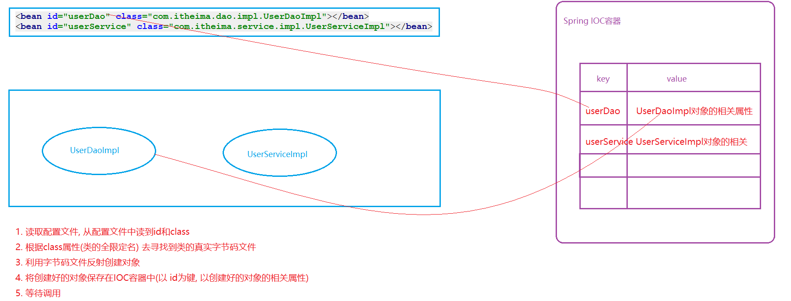
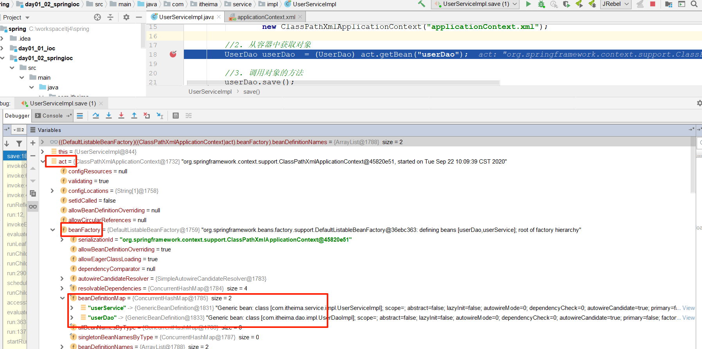

## 今日内容
+ Spring介绍
+ 认识IOC
+ Spring入门
+ DbUtils

## 第一章 Spring概述(了解)

> Spring是`分层(三层)`的Java应用`轻量级`开源框架
>
> Spring的核心是 `IOC（Inverse Of Control：反转控制）`和 `AOP（Aspect Oriented Programming：面向切面编程）`
>
> Spring一个全栈应用框架, 提供了表现层 Spring MVC 和持久层 Spring JDBC 以及业务层事务管理等众多应用技术
>
> Spring还能整合开源世界众多著名的第三方框架和类库，逐渐成为使用最多的 Java EE 企业应用开源框架 
>

**三层**

​	web(跟用户交互) ------ SpringMVC

​	service(处理业务)------ 事务-----声明式事务(Spring第三天)

​	dao(跟数据交互) ------ SpringJDBC

**轻量级**

​	用起来简单---api比较少

​	运行时占用资源少

**核心**

​	IOC   反转控制

​	AOP  面向切面编程

**思想**

​	我不重复造轮子

**体系结构**

​	 


## 第二章认识IOC(理解)

我们今天想通过service和dao层调用来推导IOC

### 1. 环境准备

1. 创建一个新的MAVEN工程,干掉src目录

2. 新建一个module,引入坐标

```xml
<dependencies>
    <dependency>
        <groupId>junit</groupId>
        <artifactId>junit</artifactId>
        <version>4.12</version>
        <scope>test</scope>
    </dependency>
</dependencies>
```

### 2.版本一：原始版本

#### 2.1创建dao接口

```java
/**
 * 创建dao接口
 */
public interface UserDao {
    /**
     * 保存数据
     */
    void save();
}

```

#### 2.2创建dao实现类

```java
public class UserDaoImpl implements UserDao {
    @Override
    public void save() {
        System.out.println("保存成功...");
    }
}

```

#### 2.3在service中创建dao

```java
public class UserServiceImpl {
    @Test
    public void save(){
        UserDao userDao = new UserDaoImpl();
        userDao.save();
    }
}
```

> service层和dao层代码耦合了
>

### 3.版本二：工厂解耦

#### 3.1创建一个生产对象的工厂

```properties
userDao=cn.com.mryhl.dao.impl.UserDaoImpl
```

#### 3.2使用工厂创建对象

```java
public class BeanFactory {
    // 创建对象
    public static Object getBean(String beanId){

        try {
            // 读取配置文件
            ResourceBundle rb = ResourceBundle.getBundle("beans");
            // 获取类的权限定名
            String className = rb.getString(beanId);
            // 反射创建对象
            Class<?> clazz = Class.forName(className);
            Object instance = clazz.newInstance();

            return instance;
        } catch (Exception e) {
            throw  new RuntimeException(e);
        }
    }
}
```

#### 问题

> 每次都会创建一个dao对象，对象是多例的，浪费了资源；而且每次使用的时候才创建，浪费了时间
>
> 希望对象可以提前创建好一个， 存储起来，等我们调用的时候，直接返回
>

### 4.版本三：优化工厂

```java
public class BeanFactory {
    // 希望对象是提前创建的,保存在一个位置 调用时直接给出去
    private static Map<String,Object> map = new HashMap<String, Object>();
    
    static {
        try {
            // 读取配置文件
            ResourceBundle rb = ResourceBundle.getBundle("beans");
            Enumeration<String> keys = rb.getKeys();
            while (keys.hasMoreElements()) {
                String key = keys.nextElement();
                // 获取类的权限定名
                String className = rb.getString(key);
                // 反射创建对象
                Class<?> clazz = Class.forName(className);
                Object instance = clazz.newInstance();
                map.put(key,instance);
            }
        } catch (Exception e) {
            throw  new RuntimeException(e);
        }
    
    }
    
    // 创建对象
    public static Object getBean(String beanId){

       return map.get(beanId);
    }
}
```

### 5.总结(IOC概念引出)

> 对象的创建由原来的**使用new关键字在类中主动创建**变成了**从工厂中获取**，而对象的创建过程由工厂内部来实现，
>
> 而这个工厂就类似Spring的IOC容器，也就是以后我们的**对象不再自己创建，而是直接向Spring要**，这种思想就是**IOC**
>


## 第三章 IOC思想介绍(重点)

> IOC(  控制  反转  )是一种设计思想,  它的目的是指导我们设计出更加松耦合的程序。(解耦)
>
> 控制：指的是控制权，现在可以简单理解为对象的创建权限
>
> 反转：指的对象的控制权由程序员在**类中主动控制(new)**反转到由**Spring容器来控制**。
>

找对象

​	传统方式 : 自己找

​	婚介所    :  先将自己的信息注册到婚介所, 然后到你需要对象的时候, 直接问婚介所要一个对象, 婚介所会给你想办法创建一个对象出来,送过来


new-----要


## 第四章 Spring的入门案例(重点)

### 1.创建一个模块,并引入spring

```xml
<?xml version="1.0" encoding="UTF-8"?>
<project xmlns="http://maven.apache.org/POM/4.0.0"
         xmlns:xsi="http://www.w3.org/2001/XMLSchema-instance"
         xsi:schemaLocation="http://maven.apache.org/POM/4.0.0 http://maven.apache.org/xsd/maven-4.0.0.xsd">
    <parent>
        <artifactId>spring</artifactId>
        <groupId>cn.com.mryhl</groupId>
        <version>1.0-SNAPSHOT</version>
    </parent>
    <modelVersion>4.0.0</modelVersion>

    <artifactId>day01_02_springioc</artifactId>
    <dependencies>
        <dependency>
            <groupId>org.springframework</groupId>
            <artifactId>spring-context</artifactId>
            <version>5.1.6.RELEASE</version>
        </dependency>
        <dependency>
            <groupId>junit</groupId>
            <artifactId>junit</artifactId>
            <version>4.12</version>
            <scope>test</scope>
        </dependency>
    </dependencies>

</project>
```

### 2.创建dao接口和实现类

```java
/**
 * 创建dao接口
 */
public interface UserDao {
    /**
     * 保存数据
     */
    void save();
}
public class UserDaoImpl implements UserDao {
    @Override
    public void save() {
        System.out.println("保存成功...");
    }
}
```

### 3. 加入Spring的配置文件

```xml
<?xml version="1.0" encoding="UTF-8"?>
<beans xmlns="http://www.springframework.org/schema/beans"
       xmlns:xsi="http://www.w3.org/2001/XMLSchema-instance"
       xmlns:p="http://www.springframework.org/schema/p"
       xsi:schemaLocation="http://www.springframework.org/schema/beans
        https://www.springframework.org/schema/beans/spring-beans.xsd">
      <!--
          bean 告诉Spring创建一个对象,将对象放入Spring的IOC容器中
            id    代表的是对象在容器中的唯一标识
            class 代表的是要根据哪一个类去创建这个对象
      -->
      <bean id="userDao" class="cn.com.mryhl.dao.impl.UserDaoImpl"></bean>
</beans>
```

### 4. 创建service实现类

```java
public class UserServiceImpl {
    @Test
    public void save(){
        // 1.读取配置文件,启动spring的IOC容器
        ClassPathXmlApplicationContext act = new ClassPathXmlApplicationContext("applicationContext.xml");
        // 2.从容器中获取对象
        UserDao userDao = (UserDao) act.getBean("userDao");
        // 3.调用对象的方法
        userDao.save();

    }
}
```


### 5.案例中的要点分析

1  SpringIOC容器启动过程中要做哪些操作

 

2  SpringIOC存储对象的Map到底在哪里




## 第五章 API介绍(了解)

### 两个接口(面试题)

#### 1.BeanFactory

这是SpringIOC容器的顶级接口，它定义了SpringIOC的最基础的功能，但是其功能比较简单,  一般面向Spring自身使用

BeanFactroy在第一次使用到某个Bean时(调用getBean())，才对该Bean进行加载实例化

#### 2.ApplicationContext

这是在BeanFactory基础上衍生出的接口，它扩展了BeanFactory的功能，一般面向程序员使用 

ApplicationContext是在容器启动时，一次性创建并加载了所有的Bean

**上面两种方式创建的对象都是单例，只是创建对象的时机不同**

```markdown
BeanFactory和ApplicationContext区别:
BeanFactory：是Spring里面最低层的接口，提供了最简单的容器的功能，只提供了实例化对象和拿对象的功能；
ApplicationContext：应用上下文，继承BeanFactory接口，它是Spring的一各更高级的容器，提供了更多的有用的功能；
1) 国际化（MessageSource）
2) 访问资源，如URL和文件（ResourceLoader）
3) 载入多个（有继承关系）上下文 ，使得每一个上下文都专注于一个特定的层次，比如应用的web层  
4) 消息发送、响应机制（ApplicationEventPublisher）
5) AOP（拦截器）
两者装载bean的区别
BeanFactory：
BeanFactory在启动的时候不会去实例化Bean，中有从容器中拿Bean的时候才会去实例化；
ApplicationContext：
ApplicationContext在启动的时候就把所有的Bean全部实例化了。它还可以为Bean配置lazy-init=true来让Bean延迟实例化； 

```

### 3. 三个实现类

这三个类的作用都是：读取配置文件, 初始化Spring的IOC容器,  不一样的是加载配置文件的位置

- ClassPathXmlApplicationContext         读取类路径下的xml作为配置文件
- FileSystemXmlApplicationContext       读取本地目录下的xml作为配置文件
- AnnotationConfigApplicationContext  读取一个Java类作为配置文件

```java
// 1.读取配置文件,启动spring的IOC容器
//ClassPathXmlApplicationContext act = new ClassPathXmlApplicationContext("applicationContext.xml");
FileSystemXmlApplicationContext act = new FileSystemXmlApplicationContext("F:\\code\\spring\\day01_02_springioc\\src\\main\\resources\\applicationContext.xml");
```

### 4.一个方法

getBean() 用于从Spring容器中获取Bean对象，参数可以使用三种情况：

- getBean("id")                     使用bean的id从容器中查找对象
- getBean(Bean.class)           使用bean的class类型从容器中查找对象
- getBean("id", Bean.class)   使用bean的id 和 class类型从容器中查找对象

```java
// 2.从容器中获取对象
// 根据id获取对象
// UserDao userDao = (UserDao) act.getBean("userDao");
// 根据class获取
// UserDao userDao = act.getBean(UserDao.class);
// 根据id和class获取
UserDao userDao = act.getBean("userDao",UserDao.class);
```

## 第六章 Bean的配置(重点)

### 1.bean的创建方式

#### 1.1创建对象的三种方式(了解)

> 我们常用的创建对象的方式有三种：
>
> 1. 直接使用new关键字创建
> 2. 使用静态工厂创建
> 3. 使用实例化工厂创建
>

```java
package cn.com.mryhl.createbeans;

import java.util.*;

public class Book {
    private String name;
    private float price;
    private Date publish;


    //集合, set  get  toString
    private String[] myArray;
    private List<String> myList;
    private Set<String> mySet;

    private Map<String,String> myMap;
    private Properties myProperties;


    public String getName() {
        return name;
    }

    public float getPrice() {
        return price;
    }

    public Date getPublish() {
        return publish;
    }

    public String[] getMyArray() {
        return myArray;
    }

    public void setMyArray(String[] myArray) {
        this.myArray = myArray;
    }

    public List<String> getMyList() {
        return myList;
    }

    public void setMyList(List<String> myList) {
        this.myList = myList;
    }

    public Set<String> getMySet() {
        return mySet;
    }

    public void setMySet(Set<String> mySet) {
        this.mySet = mySet;
    }

    public Map<String, String> getMyMap() {
        return myMap;
    }

    public void setMyMap(Map<String, String> myMap) {
        this.myMap = myMap;
    }

    public Properties getMyProperties() {
        return myProperties;
    }

    public void setMyProperties(Properties myProperties) {
        this.myProperties = myProperties;
    }

    public void setName(String name) {
        this.name = name;
    }

    public void setPrice(float price) {
        this.price = price;
    }

    public void setPublish(Date publish) {
        this.publish = publish;
    }

    public Book() {
        System.out.println("书正在创建.....");
    }

    //全参构造函数
    public Book(String name, float price, Date publish) {
        this.name = name;
        this.price = price;
        this.publish = publish;

        Date date = new Date();
        this.publish = date;
    }


    public void init(){
        System.out.println("书创建之后....");
    }

    public void des(){
        System.out.println("书销毁之前....");
    }

    @Override
    public String toString() {
        return "Book{" +
                "name='" + name + '\'' +
                ", price=" + price +
                ", publish=" + publish +
                ", myArray=" + Arrays.toString(myArray) +
                ", myList=" + myList +
                ", mySet=" + mySet +
                ", myMap=" + myMap +
                ", myProperties=" + myProperties +
                '}';
    }
}
```

```java
package cn.com.mryhl.createbeans;

//书厂
//静态工厂创建方式: 不用创建工厂的实例, 直接调用工厂类的一个静态方法来获取对象
//实例化工厂创建方式: 先创建工厂的实例, 再调用工厂实例的一个非静态方法来获取对象

//二者的区别就在于是否去   创建工厂的实例
public class BookFactory {

    //获取书
    public static Book getBook1() {
        return new Book();
    }
    //获取书
    public Book getBook2() {
        return new Book();
    }
}
```

```java
package cn.com.mryhl.createbeans;

public class CreateBean {


    public static void main(String[] args) {
        //我们常用的创建对象的方式有三种：
        //1. 直接使用new关键字创建
        Book book = new Book();

        //2. 使用静态工厂创建
        //需要我们知道1 类名  2 静态方法名
        Book book1 = BookFactory.getBook1();

        //3. 使用实例化工厂创建
        //需要1 先创建工厂实例    2 调用工厂实例的非静态方法
        BookFactory bookFactory = new BookFactory();
        Book book2 = bookFactory.getBook2();
    }
}
```

### 2.直接调用构造函数创建(重点)

```java
package cn.com.mryhl.createbeans;

import org.springframework.context.ApplicationContext;
import org.springframework.context.support.ClassPathXmlApplicationContext;

public class SpringBook {
    public static void main(String[] args) {
        //1. 同时引入多个配置文件
        ClassPathXmlApplicationContext act =
                new ClassPathXmlApplicationContext("applicationContext.xml");

        Book book = (Book) act.getBean("book1");
        
        System.out.println(book);
        

        act.close();
    }
}
```

### 3. 使用静态工厂创建

```xml
<bean id="book" class="cn.com.mryhl.createbeans.Book"></bean>
<!-- 使用静态工厂创建
      需要我们知道1 类名  2 静态方法名
      Book book1 = BookFactory.getBook1();
      class 指定的是工厂的类名
      factory-method   工厂中的静态方法的名称
-->
<bean id="book1" class="cn.com.mryhl.createbeans.BookFactory" factory-method="getBook1">
```

### 4. 使用实例化工厂创建

```xml
<!--使用实例化工厂创建
            需要1 先创建工厂实例    2 调用工厂实例的非静态方法
            BookFactory bookFactory = new BookFactory();
            Book book2 = bookFactory.getBook2();
            factory-bean     用于指定调用哪一个bean工厂对象
            factory-method   用于指定调用工厂中的哪一个非静态方法
   
   -->
<bean id="bookFactory" class="cn.com.mryhl.createbeans.BookFactory"></bean>
<bean id="book2" factory-bean="bookFactory" factory-method="getBook2"></bean>
```

### 5. bean的作用范围(面试)

> 在Spring中，对于bean支持五种作用范围：
>
> - **singleton**(默认) 单例模式，即对象只创建一次, 然后一直存在, 知道Spring容器关闭
> - **prototype**         多例模式，即每次获取bean的时候，IOC都给我们创建一个新对象
> - **request**             web项目中，Spring创建一个Bean的对象，将对象存入到request域中
> - **session**              web 项目中，Spring 创建一个Bean 的对象，将对象存入到session域中
> - **globalSession**   用于分布式web开发中，创建的实例绑定全局session对象
>

#### 5.1singleton

```xml
<!-- 单例模式,默认就是这个 -->
<bean id="book" class="cn.com.mryhl.createbeans.Book" scope="singleton"></bean>
```

#### 5.2prototype

```xml
<!-- 多例模式 -->
<bean id="book" class="cn.com.mryhl.createbeans.Book" scope="prototype"></bean>
```

### 6. bean的生命周期

> 研究bean的生命周期，无非就是弄明白bean是什么时候创建的，什么时候销毁的
>
> 在Spring中，bean的作用范围会影响到其生命周期，所以我们要分单例和多例对象来研究bean的生命周期
>

#### 6.1单例对象

生: 容器初始化

死: 容器销毁

#### 6.2多例对象

生: 每一次getBean()调用的时候出生

死: 不会受到Spring的控制, 由垃圾回收期负责回收

```xml
<!--
    Spring在内部内置了两个钩子函数,
    在对象创建之后会去调用init-method属性指定的方法
    在对象销毁之前会去调用destroy-method属性指定的方法
-->
<bean id="book" class="cn.com.mryhl.createbeans.Book"
          scope="prototype"
          init-method="init" destroy-method="des"/>
```

### 7. 依赖注入(重点)

> 依赖注入(Dependency Injection，DI) 其实就是给对象中的属性赋值的过程
>
> 依赖注入有两种方式，分别是使用构造函数和set方法
>

#### 7.1构造函数

##### 7.1.1在类中提供一个全参构造函数

```java
//全参构造函数
public Book(String name, float price, Date publish) {
    this.name = name;
    this.price = price;
    this.publish = publish;
}
```

##### 7.1.2在配置文件中进行赋值

```xml
<!--
    name  构造函数中的形参的名称
    index 构造函数中的形参的索引, 一般省略
    type  构造函数中的形参的类型,一般可以省略, 底层可以通过反射技术自己获取
    value 构造函数中的参数应该赋的值(简单类型: 基本类型 基本类型包装类型 字符串)
    ref   构造函数中的参数应该赋的值(引用类型) 用于指定当前容器中一个存在的bean对象的id
-->
<bean id="book" class="cn.com.mryhl.createbeans.Book">
    <constructor-arg name="name" value="石头记"></constructor-arg>
    <constructor-arg name="price" value="10"></constructor-arg>
    <constructor-arg name="publish" ref="publish"></constructor-arg>

</bean>
<bean id="publish" class="java.util.Date"></bean>
```

##### 7.1.3测试

```java
public class SpringBook {
    public static void main(String[] args) {
        //1. 同时引入多个配置文件
        ClassPathXmlApplicationContext act =
                new ClassPathXmlApplicationContext("applicationContext.xml");
        Book book = (Book) act.getBean("book");       
        System.out.println(book);
       // Book{name='石头记', price=10.0, publish=Tue Sep 22 17:59:35 CST 2020, myArray=null, myList=null, mySet=null, myMap=null, myProperties=null}

  }
}
```

#### 7.2set方法

##### 7.2.1在类中提供set方法

```java
public void setName(String name) {
    this.name = name;
}

public void setPrice(float price) {
    this.price = price;
}

public void setPublish(Date publish) {
    this.publish = publish;
}
```

##### 7.2.2在配置文件中进行赋值

```xml
<!--
name  set方法中的setXXX部分
value set方法应该赋的值(简单类型: 基本类型 基本类型包装类型 字符串)
ref   set方法应该赋的值(引用类型) 用于指定当前容器中一个存在的bean对象的id
-->
<bean id="book" class="cn.com.mryhl.createbeans.Book">
    <property name="name" value="西游记"></property>
    <property name="price" value="11"></property>
    <property name="publish" ref="publish"></property>
</bean>
<bean id="publish" class="java.util.Date"></bean>
```

##### 7.2.3测试

```java
public class SpringBook {
    public static void main(String[] args) {
        //1. 同时引入多个配置文件
        ClassPathXmlApplicationContext act =
                new ClassPathXmlApplicationContext("applicationContext.xml");
        Book book = (Book) act.getBean("book");       
        System.out.println(book);
       // Book{name='西游记', price=11.0, publish=Tue Sep 22 18:05:25 CST 2020, myArray=null, myList=null, mySet=null, myMap=null, myProperties=null}

  }
}
```


#### 7.3 p名称空间用法

**注意: 使用这个必须导入p的约束**

```xml
<bean id="book" class="cn.com.mryhl.createbeans.Book"
      p:name="西游记"
      p:price="12"
      p:publish-ref="publish"></bean>
<bean id="publish" class="java.util.Date"></bean>
```

### 8 注入集合属性

#### 8.1 准备集合属性

```java
//集合, set  get  toString
private String[] myArray;
private List<String> myList;
private Set<String> mySet;

private Map<String,String> myMap;
private Properties myProperties;
```

#### 8.2单列集合依赖注入

```xml
<bean id="book" class="cn.com.mryhl.createbeans.Book">
    <property name="myArray">
        <array>
            <value>AA</value>
            <value>BB</value>
        </array>
    </property>
    <property name="myList">
        <list>
            <value>CC</value>
            <value>DD</value>
        </list>
    </property>
    <property name="mySet">
        <list>
            <value>EE</value>
            <value>FF</value>
        </list>
    </property>
</bean>
```

#### 8.3双列集合依赖注入

```xml
<property name="myMap">
    <map>
        <entry key="GG" value="gg"></entry>
        <entry key="MM" value="mm"></entry>
    </map>
</property>
<property name="myProperties">
    <props>
        <prop key="XX">xx</prop>
        <prop key="YY">yy</prop>
    </props>
</property>
```


## 第七章 配置文件模块化(掌握)

我们现在的配置都集中配在了一个applicationContext.xml文件中，当开发人员过多时， 如果所有bean都配置到同一个配置文件中，会使这个文件巨大。

针对这个问题, Spring给我们提供了两种解决方案:

1. 同时引入多个配置文件

   ```xml
   <?xml version="1.0" encoding="UTF-8"?>
   <beans xmlns="http://www.springframework.org/schema/beans"
          xmlns:xsi="http://www.w3.org/2001/XMLSchema-instance"
          xmlns:p="http://www.springframework.org/schema/p"
          xsi:schemaLocation="http://www.springframework.org/schema/beans
           https://www.springframework.org/schema/beans/spring-beans.xsd">
   
       <bean id="book1" class="cn.com.mryhl.createbeans.Book" ></bean>
         
   </beans>
   
   <?xml version="1.0" encoding="UTF-8"?>
   <beans xmlns="http://www.springframework.org/schema/beans"
          xmlns:xsi="http://www.w3.org/2001/XMLSchema-instance"
          xmlns:p="http://www.springframework.org/schema/p"
          xsi:schemaLocation="http://www.springframework.org/schema/beans
           https://www.springframework.org/schema/beans/spring-beans.xsd">
   
       <bean id="book2" class="cn.com.mryhl.createbeans.Book" ></bean>
   
   </beans>
   
   ```

   ```java
   public class SpringBook {
       public static void main(String[] args) {
           //1. 同时引入多个配置文件
           ClassPathXmlApplicationContext act =
                   new ClassPathXmlApplicationContext("bean1.xml","bean2.xml");
   
           Book book1 = (Book) act.getBean("book");
           //Book book2 = (Book) act.getBean("book2");
           System.out.println(book1);
           //System.out.println(book2);
   
           act.close();
       }
   }
   ```

2. 主从配置

   ```xml
   <?xml version="1.0" encoding="UTF-8"?>
   <beans xmlns="http://www.springframework.org/schema/beans"
          xmlns:xsi="http://www.w3.org/2001/XMLSchema-instance"
          xmlns:p="http://www.springframework.org/schema/p"
          xsi:schemaLocation="http://www.springframework.org/schema/beans
           https://www.springframework.org/schema/beans/spring-beans.xsd">
         
         <import resource="bean1.xml"></import>
         <import resource="bean2.xml"></import>
         
   </beans>
   ```
   
   ```java
   public class SpringBook {
       public static void main(String[] args) {
           //1. 同时引入多个配置文件
           ClassPathXmlApplicationContext act =
                   new ClassPathXmlApplicationContext("beans.xml");
   
           Book book1 = (Book) act.getBean("book");
           //Book book2 = (Book) act.getBean("book2");
           System.out.println(book1);
           //System.out.println(book2);
   
           act.close();
       }
   }
   ```

注意:

1. 同一个xml文件中不允许出现相同名称的bean，如果出现会报错
2. 多个xml文件如果出现相同名称的bean，不会报错，但是后加载的会覆盖前加载，所以尽量保证bean的名称是唯一的。


## 第八章 DbUtils(会用)

### 1.DbUtils介绍

> java中操作数据库的框架，一定会有的方法：
>
> 	1. 发送SQL语句
>
>  	2. 接收返回的数据结果，并且封装为对象或集合

DbUtils是Apache的一款用于简化Dao代码的工具类，它底层封装了JDBC技术。

核心类：

- QueryRunner          用于执行增删改查的SQL语句
- ResultSetHandler    这是一个接口，主要作用是将数据库返回的记录封装进实体对象或集合

核心方法：

- update()    用来执行增、删、改语句  
- query()      用来执行查询语句

```java
//创建一个QueryRunner对象，用来执行增删改查
//这里需要给一个数据源，如果此处不给，那么使用它调用具体API的时候必须要给
QueryRunner queryRunner = new QueryRunner(dataSource);

//update方法，用于执行增删改语句
//第一个参数:sql语句   后面的参数:sql语句中的所需要的的值
queryRunner.update("insert into account value(null,?,?)",1,2);

//query方法，用于执行查询语句
//第一个参数:sql语句   第一个参数:封装返回值   后面的参数:sql语句中的所需要的的值
//BeanHandler用于将一条返回数据封装成一个JavaBean,  类似的子类还有BeanListHandler等
queryRunner.query("select * from account where aid = ?",  new BeanHandler<Account>(Account.class),  1); 
```

### 2. DbUtils简单使用

#### 2.1准备数据环境

```sql
CREATE TABLE account(
	aid INT PRIMARY KEY AUTO_INCREMENT,
	NAME VARCHAR(100) NOT NULL UNIQUE,
	balance FLOAT(10,2)
)
```


#### 2.2 创建一个新的模块,并引入包位置

```xml
<dependencies>
    <!--mysql-->
    <dependency>
        <groupId>mysql</groupId>
        <artifactId>mysql-connector-java</artifactId>
        <version>5.1.6</version>
    </dependency>
    <!--druid-->
    <dependency>
        <groupId>com.alibaba</groupId>
        <artifactId>druid</artifactId>
        <version>1.1.15</version>
    </dependency>
    <!--dbutils-->
    <dependency>
        <groupId>commons-dbutils</groupId>
        <artifactId>commons-dbutils</artifactId>
        <version>1.7</version>
    </dependency>
    <!--junit-->
    <dependency>
        <groupId>junit</groupId>
        <artifactId>junit</artifactId>
        <version>4.12</version>
    </dependency>
</dependencies>
```

#### 2.3创建实体类

```java
package cn.com.mryhl.domain;

/**
 * 创建实体
 */
public class Account {
    private Integer aid;
    private String name;
    private Float balance;

    public Integer getAid() {
        return aid;
    }

    public void setAid(Integer aid) {
        this.aid = aid;
    }

    public String getName() {
        return name;
    }

    public void setName(String name) {
        this.name = name;
    }

    public Float getBalance() {
        return balance;
    }

    public void setBalance(Float balance) {
        this.balance = balance;
    }

    @Override
    public String toString() {
        return "Account{" +
                "aid=" + aid +
                ", name='" + name + '\'' +
                ", balance=" + balance +
                '}';
    }
}
```

#### 2.4 测试1：新增

```java
public class DbutilsTest {
    /**
     * 新增测试
     */
    @Test
    public void testSave() throws Exception {
        // 1.创建DataSourse{驱动 连接 用户名 密码}
        DruidDataSource dataSource = new DruidDataSource();
        dataSource.setDriverClassName("com.mysql.jdbc.Driver");
        dataSource.setUrl("jdbc:mysql:///spring");
        dataSource.setUsername("root");
        dataSource.setPassword("root");
        // 2.创建QueryRunner对象
        QueryRunner queryRunner = new QueryRunner(dataSource);
        // 3.发生一条sql语句
        queryRunner.update("insert into account values (null,?,?)","B01",100f);
    }
}
```

#### 2.5 测试2：查询所有

```java
/**
 * 新增测试
 */
@Test
public void testFindAll() throws Exception {
    // 1.创建DataSourse{驱动 连接 用户名 密码}
    DruidDataSource dataSource = new DruidDataSource();
    dataSource.setDriverClassName("com.mysql.jdbc.Driver");
    dataSource.setUrl("jdbc:mysql:///spring");
    dataSource.setUsername("root");
    dataSource.setPassword("root");
    // 2.创建QueryRunner对象
    QueryRunner queryRunner = new QueryRunner(dataSource);
    // 3.发生一条sql语句
    List<Account> accountList = queryRunner.query("select * from account", new BeanListHandler<Account>(Account.class));
    for (Account account : accountList) {
        System.out.println(account);
    }
}
```

#### 2.6 测试3：根据id查询

```java
/**
 * 新增测试
 */
@Test
public void testFindById() throws Exception {
    // 1.创建DataSourse{驱动 连接 用户名 密码}
    DruidDataSource dataSource = new DruidDataSource();
    dataSource.setDriverClassName("com.mysql.jdbc.Driver");
    dataSource.setUrl("jdbc:mysql:///spring");
    dataSource.setUsername("root");
    dataSource.setPassword("root");
    // 2.创建QueryRunner对象
    QueryRunner queryRunner = new QueryRunner(dataSource);
    // 3.发生一条sql语句
    Account account = queryRunner.query("select * from account where aid = ?", new BeanHandler<Account>(Account.class),1);

    System.out.println(account);

}
```


## 第九章 使用Spring完成CRUD操作(重点)

> dao（dbutils）    service    test     【Spring】

### 1. 准备数据环境（利旧）

```sql
CREATE TABLE account(
	aid INT PRIMARY KEY AUTO_INCREMENT,
	NAME VARCHAR(100) NOT NULL UNIQUE,
	balance FLOAT(10,2)
)
```


### 2. 创建一个新模块

```xml
<dependencies>
    <!--mysql-->
    <dependency>
        <groupId>mysql</groupId>
        <artifactId>mysql-connector-java</artifactId>
        <version>5.1.6</version>
    </dependency>
    <!--druid-->
    <dependency>
        <groupId>com.alibaba</groupId>
        <artifactId>druid</artifactId>
        <version>1.1.15</version>
    </dependency>
    <!--dbutils-->
    <dependency>
        <groupId>commons-dbutils</groupId>
        <artifactId>commons-dbutils</artifactId>
        <version>1.7</version>
    </dependency>
    <!--junit-->
    <dependency>
        <groupId>junit</groupId>
        <artifactId>junit</artifactId>
        <version>4.12</version>
    </dependency>
    <!--spring-->
    <dependency>
        <groupId>org.springframework</groupId>
        <artifactId>spring-context</artifactId>
        <version>5.1.6.RELEASE</version>
    </dependency>
</dependencies>
```

### 3.创建实体类

```java
package cn.com.mryhl.domain;

public class Account {
    private Integer aid;
    private String name;
    private Float balance;

    public Integer getAid() {
        return aid;
    }

    public void setAid(Integer aid) {
        this.aid = aid;
    }

    public String getName() {
        return name;
    }

    public void setName(String name) {
        this.name = name;
    }

    public Float getBalance() {
        return balance;
    }

    public void setBalance(Float balance) {
        this.balance = balance;
    }

    @Override
    public String toString() {
        return "Account{" +
                "aid=" + aid +
                ", name='" + name + '\'' +
                ", balance=" + balance +
                '}';
    }
}
```

### 4.创建dao接口

```java
public interface AccountDao {
    /**
     * 保存
     */
    void save(Account account);

    /**
     * 查询所有
     */
    List<Account> findAll();

    /**
     * 根据name查询
     */
    Account findByName(String name);

    /**
     * 根据name修改
     */
    void update(Account account);

    /**
     * 删除
     */
    void deleByName(String name);
}
```

### 5.创建dao实现类

```java
public class AccountDaoImpl implements AccountDao {
    // 我们需要用 QueryRunner 操作数据库, 就要获取到QueryRunner, 而用了spring之后,不允许我们自己new 只能问spring要
    // Spring会给我们进行赋值, 这个过程就称为依赖注入(DI) , DI有两种方式, 我们推荐使用set方式
    // 必须提供属性set方法

    //=========希望Spring给我们注入这个对象==============
    private QueryRunner queryRunner;
	public void setQueryRunner(QueryRunner queryRunner) {
        this.queryRunner = queryRunner;
    }
    public void save(Account account) {
        try {
            queryRunner.update("insert into account values(null,?,?)", account.getName(), account.getBalance());
        } catch (SQLException e) {
            e.printStackTrace();
        }
    }

    public List<Account> findAll() {
        try {
            return queryRunner.query("select * from account", new BeanListHandler<Account>(Account.class));
        } catch (SQLException e) {
            e.printStackTrace();
        }
        return null;
    }

    public Account findByName(String name) {
        try {
            return queryRunner.query("select * from account where name = ?", new BeanHandler<Account>(Account.class), name);
        } catch (SQLException e) {
            e.printStackTrace();
        }

        return null;
    }

    public void update(Account account) {
        try {
            queryRunner.update("update account set balance = ? where name = ?", account.getBalance(), account.getName());
        } catch (SQLException e) {
            e.printStackTrace();
        }
    }

    public void deleByName(String name) {
        try {
            queryRunner.update("delete from account where name = ?", name);
        } catch (SQLException e) {
            e.printStackTrace();
        }
    }

    
}
```

### 6.创建service接口

```java
public interface AccountService {
    /**
     * 保存
     */
    void save(Account account);

    /**
     * 查询所有
     */
    List<Account> findAll();

    /**
     * 根据name查询
     */
    Account findByName(String name);

    /**
     * 根据name修改
     */
    void update(Account account);

    /**
     * 删除
     */
    void deleByName(String name);
}
```

### 7.创建service实现类

```java
public class AccountServiceImpl implements AccountService {
    //希望Spring给我们注入这个对象
    private AccountDao accountDao;
    public void setAccountDao(AccountDao accountDao) {
        this.accountDao = accountDao;
    }

    public void save(Account account) {
        accountDao.save(account);
    }

    public List<Account> findAll() {
        return accountDao.findAll();
    }

    public Account findByName(String name) {
        return accountDao.findByName(name);
    }

    public void update(Account account) {
        accountDao.update(account);
    }


    public void deleByName(String name) {
        accountDao.deleByName(name);
    }
}
```

### 8.加入spring的配置文件

```xml
<?xml version="1.0" encoding="UTF-8"?>
<beans xmlns="http://www.springframework.org/schema/beans"
       xmlns:xsi="http://www.w3.org/2001/XMLSchema-instance"
       xmlns:p="http://www.springframework.org/schema/p"
       xsi:schemaLocation="http://www.springframework.org/schema/beans
        https://www.springframework.org/schema/beans/spring-beans.xsd">

   <bean id="dateSource" class="com.alibaba.druid.pool.DruidDataSource">
        <property name="driverClassName" value="com.mysql.jdbc.Driver"></property>
        <property name="url" value="jdbc:mysql:///spring"></property>
        <property name="username" value="root"></property>
        <property name="password" value="root"></property>
    </bean>
    <bean id="queryRunner" class="org.apache.commons.dbutils.QueryRunner">
        <constructor-arg name="ds" ref="dateSource"></constructor-arg>
    </bean>

    <bean id="accountDao" class="cn.com.mryhl.dao.impl.AccountDaoImpl">
        <property name="queryRunner" ref="queryRunner"></property>
    </bean>
    <bean id="accountService" class="cn.com.mryhl.service.impl.AccountServiceImpl">
        <property name="accountDao" ref="accountDao"></property>
    </bean>

</beans>
```

### 9. 测试

```java
public class AccountServiceTest {
    // 读取配置文件
    ClassPathXmlApplicationContext act = new ClassPathXmlApplicationContext("applicationContext.xml");
    // 从容器中获取service对象
    AccountService accountService = act.getBean(AccountService.class);

    /**
     * 保存
     */
    @Test
    public void testSave() throws Exception {
        //  调用对象方法
        Account account = new Account();
        account.setName("B02");
        account.setBalance(100f);
        accountService.save(account);
    }

    /**
     * 查找全部
     */
    @Test
    public void testFindAll() throws Exception {
        //  调用对象方法
        List<Account> accountList = accountService.findAll();
        for (Account account : accountList) {
            System.out.println(account);
        }
    }


    /**
     * 查找一个
     */
    @Test
    public void testFindByName() throws Exception {
        //  调用对象方法
        Account account = accountService.findByName("B02");
        System.out.println(account);
    }

    /**
     * 根据name修改
     */
    @Test
    public void testUpdate() throws Exception {
        //  调用对象方法
        Account account = new Account();
        account.setName("B01");
        account.setBalance(200f);

        accountService.update(account);

    }
    /**
     * 查找一个
     */
    @Test
    public void testdele() throws Exception {

        accountService.deleByName("B02");

    }
}
```


